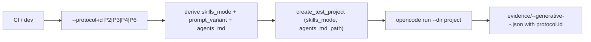

# Phase 0 — Protocol-aware harness

Drills into Phase 0 of [pyasc_skill_stack_quarterly_roadmap_aed2c154.plan.md](pyasc_skill_stack_quarterly_roadmap_aed2c154.plan.md) and only that phase. Sized at ~5 engineer-days across ~1.5 weeks. All changes are additive: no schema bump, no breaking change to existing aggregator/dashboard contracts.

## Outcome

After this sprint, [tests/tools/collect_generative_evidence.py](../../tests/tools/collect_generative_evidence.py) can drive a generative run for any of the four protocols documented in [docs/evaluation-methodology.md](../../docs/evaluation-methodology.md) §"Generation protocol taxonomy" — P2 (minimal, skills off), P3 (guided, skills off), P4 (guided, AGENTS.md mounted, skills off), P6 (guided, skills on) — and CI exercises all four on `cloud-default` for every capability cell.

## Stage 0.1 — Design: additive schema + filename scheme (~0.5 ED)

Decide and document, do not code yet.

- Filename scheme:
  - Legacy `evidence/<op>-<dtype>-generative.json` is preserved as a back-compat alias for `cloud-default + P6` (today's primary `on` leg). The aggregator continues to read it.
  - New per-protocol files: `evidence/<op>-<dtype>-generative-<profile>-<protocol_id_lower>.json`, e.g. `evidence/abs-f16-generative-cloud-default-p2.json`.
  - Existing `<op>-<dtype>-generative-<profile>-{on,off}.json` files for local profiles are preserved; the aggregator treats `on` as P6 and `off` as P3 when no protocol_id file exists for that cell.
- Schema additions (still `schema_version: "3"`, additive optional):

```json
{
  "protocol": {
    "id": "P6",
    "name": "opencode-skills-on-guided",
    "prompt_variant": "guided",
    "skills_enabled": true,
    "allowed_context": {
      "task_prompt": true,
      "agents_md": false,
      "skills": true,
      "golden_kernels": false
    }
  }
}
```

- Mapping table from `--protocol-id` to existing flags. This is the single source of truth that 0.3 and 0.5 read:
  - P2 → `skills_mode=off`, `prompt_variant=minimal`, `agents_md=false`.
  - P3 → `skills_mode=off`, `prompt_variant=guided`, `agents_md=false`.
  - P4 → `skills_mode=off`, `prompt_variant=guided`, `agents_md=true`.
  - P6 → `skills_mode=on`, `prompt_variant=guided`, `agents_md=false`.
- Deliverable: ~30-line section appended to [docs/evaluation-methodology.md](../../docs/evaluation-methodology.md) titled "Protocol-axis CI mapping (Phase 0)".

## Stage 0.2 — Complete `prompt_variants.minimal` for every cell (~0.5 ED)

Today only `abs/{f16,f32}` and `gelu/f16` have a `prompt_variants.minimal`. Without minimal prompts for the remaining 9 cells, P2 is unmeasurable. Add minimal prompts following the labeling rule in [docs/evaluation-methodology.md](../../docs/evaluation-methodology.md) §"Prompt-variant labeling rules": *operator name, dtype, shape, semantic definition only*.

Cells needing `prompt_variants.minimal` in [capabilities.yaml](../../capabilities.yaml):

- `add/f16`
- `reduce_sum/f32`
- `reduce_sum/f16`
- `gelu/f32`
- `leaky_relu/f16`
- `softmax/f16`
- `matmul/f16`
- `rms_norm/f16`
- `rms_norm/f32`

Update [tests/tools/check_capabilities.py](../../tests/tools/check_capabilities.py) `_check_cell` to require both `prompt_variants.minimal` and `prompt_variants.guided` for every cell. Add a one-line warning (not failure) when a cell is missing either, then promote to hard-fail once the cells are filled in.

Deliverable: 9 new minimal prompts in [capabilities.yaml](../../capabilities.yaml); updated check_capabilities; one local pr-gate run green.

## Stage 0.3 — AGENTS.md-only project layout (~1 ED)

Today [tests/tools/collect_generative_evidence.py](../../tests/tools/collect_generative_evidence.py) `create_test_project` has two layouts (`on` and `off`). Neither matches P4 ("OpenCode + AGENTS.md, no skills"). Add a third layout.

Concrete edits in [tests/tools/collect_generative_evidence.py](../../tests/tools/collect_generative_evidence.py):

- Vendor the baseline AGENTS.md once into the repo: copy `/home/aloschilov/workspace/pyasc-fork/AGENTS.md` to `docs/baseline/pyasc-fork-AGENTS.md` and pin its SHA in a header comment. (CI must not depend on a sibling checkout.)
- Add `--agents-md-source` argparse flag, defaulting to `docs/baseline/pyasc-fork-AGENTS.md` relative to `REPO_ROOT`. Add `--no-agents-md` to suppress mounting.
- Extend `create_test_project(skills_mode, profile, ..., agents_md_path: Path | None)`:
  - If `agents_md_path` is given, copy it to `<project>/AGENTS.md` *after* the other layout work, regardless of `skills_mode`.
  - Document the precedence: if `skills_mode=on` *and* `agents_md_path` is given, the user gets both AGENTS.md *and* the skills team's AGENTS.md. The current `on` leg already vendors `teams/pyasc-kernel-dev-team/AGENTS.md`; that is the skill-stack AGENTS.md, not the pyasc-fork baseline. They are intentionally distinct files (see [teams/pyasc-kernel-dev-team/AGENTS.md](../../teams/pyasc-kernel-dev-team/AGENTS.md) vs the new baseline copy). For P4 we want the baseline only.
- Refuse contradiction: `--protocol-id P4` with `--skills-mode on` exits 1 with a clear message.

Deliverable: new layout, new flag, the AGENTS.md baseline vendored, one local probe run for `abs/f16 + P4` produces an evidence file with `protocol.id == "P4"` and the kernel project directory contains exactly `golden/`, `AGENTS.md`, `opencode.json`.

## Stage 0.4 — `--protocol-id` flag + derivation logic (~1 ED)

Concrete edits in [tests/tools/collect_generative_evidence.py](../../tests/tools/collect_generative_evidence.py):

- Add `--protocol-id {P2,P3,P4,P6}` to argparse.
- When supplied, derive `skills_mode`, `prompt_variant`, `agents_md` per the 0.1 mapping table. If user also passes `--skills-mode` or `--prompt-variant`, validate match; on mismatch exit 1 with a diff.
- Filename selection in `main`:
  - If `--protocol-id` is given: emit `<op>-<dtype>-generative-<profile>-<protocol_id_lower>.json`. The legacy `cloud-default + on` short name is no longer used in this code path.
  - Otherwise: today's behavior unchanged (legacy short name for `cloud-default + on`, `*-<profile>-<mode>.json` for everything else).
- Evidence document additions:
  - Add `protocol` object (per 0.1 schema). Populate `name` from a small static map (`P6 -> opencode-skills-on-guided`, etc).
  - Continue to write the existing `skills_mode`, `model_profile`, `prompt` fields for back-compat.
- Add a one-line `print` summary of the resolved protocol at the start of each run.

Mermaid summarizing the resolved flow:



Deliverable: working `--protocol-id` flag; unit test in [tests/unit/tools/](../../tests/unit/tools/) asserts the derivation table; one dry-run per protocol on `abs/f16` writes the expected filename.

## Stage 0.5 — CI matrix expansion to 4 legs (~1 ED)

Concrete edits in [.github/workflows/ci.yml](../../.github/workflows/ci.yml):

- `nightly-gate.strategy.matrix`: replace `skills_mode: ["on", "off"]` with `protocol_id: ["P2", "P3", "P4", "P6"]`.
- In the "Run OpenCode skills-intervention leg" step, replace `--skills-mode "$SKILLS_MODE"` with `--protocol-id "$PROTOCOL_ID"`. The body of the loop is otherwise unchanged.
- Adjust the per-leg minimum-pass threshold gate (today only on `SKILLS_MODE == on`) to apply only when `PROTOCOL_ID == "P6"`. P2/P3/P4 are explicitly allowed to underperform.
- Upload-artifact step `path:` expression: switch from the ternary on `skills_mode` to a glob keyed on `protocol_id`: `evidence/*-generative-cloud-default-${{ matrix.protocol_id_lower }}.json`. (Compute `protocol_id_lower` via `env` with a small `bash`-side `tr '[:upper:]' '[:lower:]'` to avoid GitHub Actions expression limitations.)
- Artifact name: `evidence-cloud-${{ matrix.protocol_id }}` instead of `evidence-cloud-${{ matrix.skills_mode }}`.
- `local-stability-gate`: leave untouched in this sprint (still uses `skills_mode: ["on", "off"]`). Doubling local-model cost is a Phase 6 decision.
- Update [tests/tools/merge_evidence_artifacts.sh](../../tests/tools/merge_evidence_artifacts.sh) so the new `evidence-cloud-P*` artifact directories are folded into `evidence/` with their existing per-leg-specific glob discipline.

Deliverable: one workflow_dispatch dry-run on a feature branch with `tier=nightly` produces 12 cells × 4 protocols = 48 evidence files in `cloud-default` (modulo failures), no overlap with the legacy filenames, and `skills-value-report` runs the aggregator without crashing on the new files.

## Stage 0.6 — Aggregator + dashboard per-protocol view (~1 ED)

Concrete edits.

- [tests/tools/compare_skills_value.py](../../tests/tools/compare_skills_value.py):
  - Extend the evidence scan to discover `<op>-<dtype>-generative-<profile>-<protocol_id>.json` in addition to today's legacy and `<profile>-{on,off}` patterns.
  - Group by `(profile, protocol_id)` when `protocol.id` is present; fall back to `(profile, skills_mode)` for legacy files.
  - Emit new top-level fields in `evidence/skills-value-summary.json` (additive on `schema_version: "2"`):

```yaml
schema_version: "2"
by_profile:
  cloud-default:
    by_protocol:
      P2: { pass_rate: 0.0, attempts_to_pass_mean: null, tokens_mean: 12000, n_cells: 12, n_clean: 12 }
      P3: { pass_rate: 0.4, attempts_to_pass_mean: 1.3, tokens_mean: 25000, n_cells: 12, n_clean: 11 }
      P4: { pass_rate: 0.6, attempts_to_pass_mean: 1.2, tokens_mean: 26000, n_cells: 12, n_clean: 12 }
      P6: { pass_rate: 0.92, attempts_to_pass_mean: 1.1, tokens_mean: 32000, n_cells: 12, n_clean: 12 }
    deltas_pp:
      "P3-P2": { pass_pp: 40, tokens_pct: 108, attempts_delta: 0.3 }
      "P4-P3": { pass_pp: 20, tokens_pct: 4, attempts_delta: -0.1 }
      "P6-P4": { pass_pp: 32, tokens_pct: 23, attempts_delta: -0.1 }
      "P5-P2": null  # P5 not yet run
```

  - Continue to emit the existing `pass_rate_off`, `pass_rate_off_clean`, `viability_unlocked_clean`, `delta_*` per-cell fields so the v1 dashboard keeps rendering.
- [tests/tools/sync_capabilities.py](../../tests/tools/sync_capabilities.py):
  - Treat the `P6` evidence (or its legacy alias) as the authoritative input for `generative_status` updates. Other protocols are reporting-only.
- [tests/tools/generate_dashboard.py](../../tests/tools/generate_dashboard.py):
  - Add a "Skill stack value decomposition" panel rendering the 4 deltas for `cloud-default`.
  - When a protocol leg has zero clean cells, render `"protocol Pn unavailable: ..."` per the existing headline-rendering convention.
- Update the smoke test [tests/tools/skills_value_smoke.py](../../tests/tools/skills_value_smoke.py) to include at least one P2 + P3 + P4 + P6 fixture file; assert the aggregator emits `by_protocol` and `deltas_pp` correctly.

Deliverable: aggregator handles both legacy and protocol-id evidence files in one pass; smoke test green; one local dashboard regen renders the new panel.

## Stage 0.7 — Minimum first experiment: abs/f16 × 4 protocols (~0.5 ED)

End-to-end validation of stages 0.1–0.6 on a single cell before scaling to all 12.

Commands (run locally on the host with CANN sourced):

```bash
for p in P2 P3 P4 P6; do
  python3.10 tests/tools/collect_generative_evidence.py \
    --op abs --dtype float16 \
    --runtime --timeout 420 --docker-timeout 1500 \
    --model-profile cloud-default \
    --protocol-id "$p" \
    --max-attempts 3 \
    --archive-dir generative-archive \
    --notes "Phase 0 minimum first experiment ($p)"
done

python3.10 tests/tools/compare_skills_value.py \
  --output evidence/skills-value-summary.json \
  --markdown skills-value-report.md
```

Acceptance:

- 4 evidence files exist at `evidence/abs-f16-generative-cloud-default-p{2,3,4,6}.json`.
- Each has `protocol.id` set correctly and populated `tokens`, `kernel_path`, `agent.artifacts_found`, `verification.status`.
- None are classified as `validity=infra_fail` by the aggregator (this is the smoke check that the AGENTS.md path and the minimal-prompt path both produce comparable runs).
- `evidence/skills-value-summary.json` `by_profile.cloud-default.by_protocol` has all 4 keys populated.
- `evidence/skills-value-summary.json` `by_profile.cloud-default.deltas_pp` has all 3 deltas populated (P5-P2 stays null).

If green: push the feature branch and dispatch the nightly with `tier=nightly` to scale to all 12 cells. Expected end state: 48 fresh evidence files plus `skills-value-summary.json` showing the 4-protocol decomposition.

If any leg fails the validity check, do not scale — fix the harness for that leg first.

## Definition of done for Phase 0

- `--protocol-id` flag merged in [tests/tools/collect_generative_evidence.py](../../tests/tools/collect_generative_evidence.py) with the derivation table tested.
- All 12 cells in [capabilities.yaml](../../capabilities.yaml) have both `prompt_variants.minimal` and `prompt_variants.guided`; [tests/tools/check_capabilities.py](../../tests/tools/check_capabilities.py) enforces.
- `docs/baseline/pyasc-fork-AGENTS.md` vendored with a SHA pin.
- CI `nightly-gate` runs 4 legs (P2/P3/P4/P6) for `cloud-default` per dispatch.
- `evidence/skills-value-summary.json` exposes `by_protocol` and `deltas_pp` for `cloud-default`.
- Dashboard renders the "Skill stack value decomposition" panel.
- One full nightly green: 48 evidence files written, no infra_fail, `P6 ≥ 9/12` cells passing (today's `on` baseline).

## Risks specific to Phase 0

- **AGENTS.md duplicate role.** The skills-on layout already mounts [teams/pyasc-kernel-dev-team/AGENTS.md](../../teams/pyasc-kernel-dev-team/AGENTS.md), which is the *skill-stack* AGENTS.md. The vendored `docs/baseline/pyasc-fork-AGENTS.md` is the *baseline* AGENTS.md. Mixing them under P6 would conflate "skill value" with "baseline AGENTS.md value". Mitigation: P6 keeps the skill-stack AGENTS.md only; P4 keeps the baseline AGENTS.md only. The derivation logic in Stage 0.4 enforces this — `--protocol-id P6` does *not* mount the baseline.
- **Token cost.** Doubling the matrix from 2 legs to 4 legs on `cloud-default` is +~2× nightly OpenCode spend. If the budget binds, route P2 and P4 to a less expensive schedule (e.g. weekly) by adding a second `workflow_dispatch.tier` value `protocol-full` once Phase 3 wants the full 4 legs nightly.
- **Schema confusion.** Adding optional `protocol` to `schema_version: "3"` documents could surprise v3-strict readers. The repo doesn't have any (every reader is permissive), but call this out in the [docs/evaluation-methodology.md](../../docs/evaluation-methodology.md) update so the eventual v4 bump in Phase 7 stays clean.
- **`prompt_variants.minimal` quality.** A too-terse minimal prompt may produce an `infra_fail`-shaped failure that is actually expected at P2 (model gave up). The aggregator's `_classify_validity` flags `infra_fail` only when `model in {null, ""} AND tokens.total == 0 AND agent.artifacts_found == [] AND kernel_path == ""`; a P2 run that produced *some* tokens and no kernel will be `validity=ok, F10_no_artifact`, which is the desired classification. Verify on a Stage 0.7 P2 run before scaling.
- **Back-compat for `local-stability-gate`.** This sprint leaves `local-stability-gate` on the legacy `skills_mode: [on, off]` matrix. The aggregator must therefore handle a *mixture* of legacy filenames (local profiles) and new protocol-id filenames (cloud-default) in one pass. Tested in Stage 0.6 smoke fixture.

## Deferred from Phase 0 (intentionally)

- P5 (minimal prompt + skills on). Documented in [docs/evaluation-methodology.md](../../docs/evaluation-methodology.md) §"Comparisons of interest" but not in the CI matrix yet. The aggregator emits `P5-P2: null` until a future sprint adds the leg.
- P7 (oracle-guided, golden-kernels mounted) and P8 (human-assisted). Diagnostic upper bounds only, per the methodology doc.
- Migrating `local-stability-gate` to the 4-protocol matrix. Doubles local-model wall-clock budget; revisit in Phase 6.
- Schema v4 + `failure_category` auto-fill. Phase 7.
- The dashboard "view C" (model/profile capability matrix). Phase 7+.
