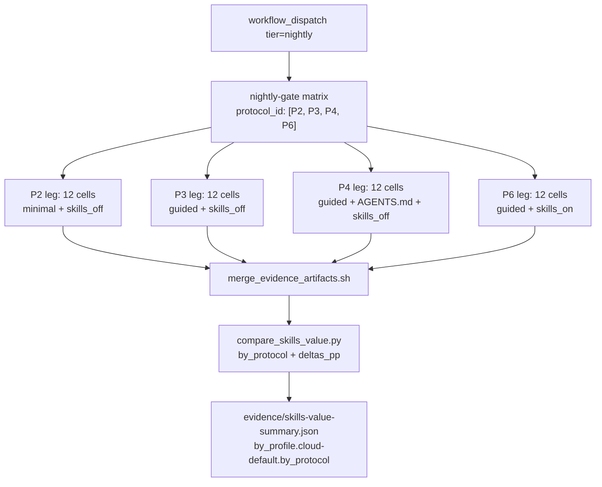

# Phase 3 — AGENTS.md baseline and token decomposition

Drills into Phase 3 of [pyasc_skill_stack_quarterly_roadmap_aed2c154.plan.md](pyasc_skill_stack_quarterly_roadmap_aed2c154.plan.md) and only that phase. Sized at ~5 engineer-days across ~2 weeks (3 nightlies consumed by the stability sweep). Strict prerequisites: Phase 0 and Phase 2 fully landed.

## Outcome

For the first time the matrix can answer "how much of today's apparent skill value is really just guided-prompt value or AGENTS.md value?". The dashboard renders three first-class deltas — `P3−P2` (prompt), `P4−P3` (AGENTS.md), `P6−P4` (skills) — with Wilson 95% confidence intervals derived from three independent nightlies. The headline number on the dashboard verdict line shifts from "skills value" to "skill-stack value decomposition", and the existing `pass_rate_off → pass_rate_on` framing in [evidence/skills-value-summary.json](../../evidence/skills-value-summary.json) becomes one of several derived views, not the only view.

## Stage 3.1 — Pre-flight check (~0.2 ED)

Hard gate. Do nothing else until both checks pass.

- Phase 0 DoD:
  - `--protocol-id` flag merged in [tests/tools/collect_generative_evidence.py](../../tests/tools/collect_generative_evidence.py).
  - `docs/baseline/pyasc-fork-AGENTS.md` vendored.
  - CI `nightly-gate` matrix is `protocol_id: [P2, P3, P4, P6]`.
  - One end-to-end abs/f16 × 4 protocols evidence set exists in [evidence/](../../evidence/).
- Phase 2 DoD:
  - 12/12 cells follow the 13-slot template.
  - 4 cells (`gelu/f32`, `matmul/f16`, `rms_norm/{f16,f32}`) carry an explicit `prompt_variants.oracle_guided` for any workaround content.
  - `examples_policy` populated for every cell.

If any check fails, this sprint does not start. Push the missing work back to Phase 0 or Phase 2.

## Stage 3.2 — Token-budget rehearsal (~0.5 ED)

The 4-leg nightly is ~2× the OpenCode spend of today's 2-leg nightly. Confirm the budget before scaling, do not discover it.

- Read the Phase 0 abs/f16 × 4 protocols evidence: extract `tokens.total` per leg, then extrapolate `12 × mean_tokens_per_leg × 4 legs = nightly budget`.
- Compare to today's nightly cost (2 legs × 12 cells). Document the multiplier in [docs/perf-methodology/](../../docs/perf-methodology/) so future budget conversations have a number.
- Decision tree:
  - If projected cost is ≤2.5× today's: proceed with all 4 legs nightly.
  - If projected cost is >2.5×: add a `workflow_dispatch.tier` value `protocol-full` to [.github/workflows/ci.yml](../../.github/workflows/ci.yml) that runs P2 + P4 only on schedule (e.g., weekly Saturday). The standard nightly keeps P3 + P6 only. Phase 3's three-night stability sweep then runs three weekly `protocol-full` dispatches for P2 + P4 and uses three consecutive nightlies for P3 + P6.

Deliverable: budget projection memo in [docs/perf-methodology/phase-3-budget.md](../../docs/perf-methodology/); CI scheduling decision documented.

## Stage 3.3 — First full-matrix nightly (~1 ED)

Dispatch `gh workflow run CI --ref main -f tier=nightly` (or `protocol-full` if Stage 3.2 chose the split schedule).

Verify before publishing:

- 48 fresh evidence files (modulo per-cell failures) in [evidence/](../../evidence/) for `cloud-default`.
- `validity=infra_fail` count is 0 across all 4 legs (Phase 0's preflight should already guarantee this).
- `by_profile.cloud-default.by_protocol` has all 4 keys populated.
- `deltas_pp` has `P3-P2`, `P4-P3`, `P6-P4` populated; `P5-P2` stays `null` (P5 deferred to Phase 6).

Failure modes to watch for and triage rather than commit:

- A P2 leg cell that produces `tokens.total == 0` for the whole nightly is a P2 prompt that the model refuses to act on. Acceptable as `validity=ok, F10_no_artifact` — do not classify as infra_fail.
- A P4 leg cell that succeeds at much higher token cost than P6 reveals the baseline AGENTS.md is more verbose than needed; not a regression.

Deliverable: one nightly committed by the existing `skills-value-report` job; one `chore: update generative evidence` commit on main containing the 48 new files.

## Stage 3.4 — Stability sweep (~1.5 ED)

Three nightlies are the minimum to characterize delta noise. Cloud models are not deterministic at temperature ≠ 0, and the simulator has its own noise floor.

- Three consecutive nightly runs (or three weekly `protocol-full` runs if Stage 3.2 chose split scheduling).
- For each cell, compute `delta` per pair `(P3-P2, P4-P3, P6-P4)` per nightly. Classify:
  - **Stable:** all three nightly deltas within ±5 pp of their median.
  - **Noisy:** swing >5 pp but <20 pp. Acceptable; reported with the Wilson CI band.
  - **Regressed:** swing ≥20 pp or sign-flip between nightlies. Hard-stop: isolate cause before publishing.
- Common causes for "regressed":
  - Model temperature (the OPENCODE_CONFIG secret may pin temperature ≠ 0 for the cloud profile).
  - Simulator nondeterminism on long shapes (matmul `[32, 32]`, softmax `[32, 4096]`).
  - Harness drift (e.g., a `merge_evidence_artifacts.sh` race that picks up a stale file).

If a sign-flip is detected, run the failing cell in isolation under `--keep-project` and inspect the agent trajectory; do not publish a misleading delta on the dashboard.

Deliverable: 3 nightlies in [evidence/skills-value-summary.json](../../evidence/skills-value-summary.json) history; a "noise floor" section in the Stage 3.6 findings doc; zero unresolved sign-flips.

## Stage 3.5 — Dashboard "Skill stack value decomposition" panel (~1.5 ED)

Concrete edits in [tests/tools/generate_dashboard.py](../../tests/tools/generate_dashboard.py).

Panel content per profile (today, only `cloud-default`):

- Three rows, one per delta pair: `P3 − P2` (label: "Prompt value"), `P4 − P3` (label: "AGENTS.md value"), `P6 − P4` (label: "Skill-stack value").
- Each row shows: `delta_pass_pp` (the headline number), Wilson 95% CI in brackets, `delta_tokens_pct`, `delta_attempts_mean`. Render `null` deltas as "unavailable: <reason>" per the existing headline-rendering convention.
- A footnote band with the cells that drove each delta most (top-3 positive + top-3 negative).
- Link to [docs/evaluation-methodology.md](../../docs/evaluation-methodology.md) §"Comparisons of interest" so a reader can verify what each delta means.

Aggregator additions to [tests/tools/compare_skills_value.py](../../tests/tools/compare_skills_value.py):

- For each delta pair, compute the per-pair Wilson 95% CI over the three-nightly history (so the panel can render confidence even on small samples).
- Add `deltas_pp_history` to the by-profile aggregate: a list of the three per-night deltas, indexed by date.
- Continue to emit the legacy `pass_rate_off → pass_rate_on` framing so older dashboard renderings keep working.

Deliverable: panel renders on the staging dashboard; one screenshot in [docs/](../../docs/) for the Stage 3.6 writeup.

## Stage 3.6 — Publish findings (~0.3 ED)

Write [docs/skill-value-q1-findings.md](../../docs/) summarizing:

- Three-night median for each of `P3−P2`, `P4−P3`, `P6−P4`, with Wilson CI.
- Per-cell breakdown of the top contributors and detractors per delta.
- Failure-mode mix per protocol (F1..F13 counts per leg) from the aggregator's derived `failure_mode_counts_*` fields.
- Budget realized vs Stage 3.2 estimate.
- Outstanding anomalies for Phase 5 (tail/mask) or Phase 6 (model-size) follow-up.

Honesty discipline: if `P4 − P3` is large (e.g. >20 pp), explicitly state that today's "skill value" headline conflated AGENTS.md value with skill value. The dashboard verdict line gets the same treatment.

Deliverable: one commit to main with the findings doc, the updated dashboard, and one short note appended to [docs/evaluation-methodology.md](../../docs/evaluation-methodology.md) §"Baseline validity" noting that Phase 3 is the first measurement against a clean AGENTS.md-aware baseline.

## Definition of done for Phase 3

- Three nightly runs in the history of [evidence/skills-value-summary.json](../../evidence/skills-value-summary.json) under the 4-protocol matrix.
- `by_protocol`, `deltas_pp`, `deltas_pp_history` populated for `cloud-default`.
- Dashboard renders the value-decomposition panel.
- [docs/skill-value-q1-findings.md](../../docs/) committed.
- Budget multiplier documented in [docs/perf-methodology/phase-3-budget.md](../../docs/perf-methodology/).
- Zero unresolved sign-flips between nightlies.

## Risks specific to Phase 3

- **Budget overrun.** 2× nightly OpenCode spend is the projection; reality could be 3× if P2 frequently exhausts `--max-attempts 3` chasing missing context. Mitigation: drop `--max-attempts` to 2 for P2 only (a P2 cell that doesn't produce an artifact in 2 attempts is exactly the F10 signal we want; further retries waste budget).
- **`P4 − P3` is suspect.** The vendored [docs/baseline/pyasc-fork-AGENTS.md](../../docs/baseline/) is generic — it doesn't mention asc2 at all. The honest reading is that P4 will look very similar to P3, and `P4 − P3` near zero is the *real* finding (not a bug). Communicate this in the findings doc.
- **`P6 − P4` shrinks the skill-stack headline.** If `P4 − P3` is non-trivial after Phase 0's clean baseline arrives, the skill value will *look smaller* than today's dashboard implies. This is the entire point of Phase 3. Do not engineer to it.
- **Per-cell noise overwhelms small deltas.** Tier-0 ops (`abs`, `add`) likely pass everywhere; the deltas there are zero by construction. The interesting signal is at Tier 2/3 (`gelu/f32`, `matmul/f16`, `rms_norm/*`). If the noisy cells are also the high-delta cells, the CI bands will be wide — accept this and surface it on the dashboard rather than hiding it.
- **`oracle_guided` accidentally folded into `guided`.** Stage 2.2 was supposed to extract oracle content; a buggy extraction would inflate `P3 − P2`. Stage 3.1's check verifies the four affected cells, but a Stage 3.4 sanity check should diff each `prompt_variants.guided` against the version in the Phase 2 commit.

## Deferred from Phase 3 (intentionally)

- **P5 leg (minimal prompt + skills on).** The aggregator emits `P5-P2: null` until added in a later sprint; the methodology doc says P5 is a documented comparison of interest, not part of the v1 panel.
- **Local-stability-gate scaling to 4 legs.** Doubling local-model wall-clock is Phase 6.
- **Cross-model variance studies.** Phase 6 explicitly.
- **Per-cell deep-dive failure-mode triage beyond F1..F13 counts.** Lives in Phase 5 (tail/mask, which is what most F4/F8 failures will point at).
- **Performance metrics (`runtime_ms`, `speedup_vs_reference`).** Phase 7+ once the simulator emits them.
