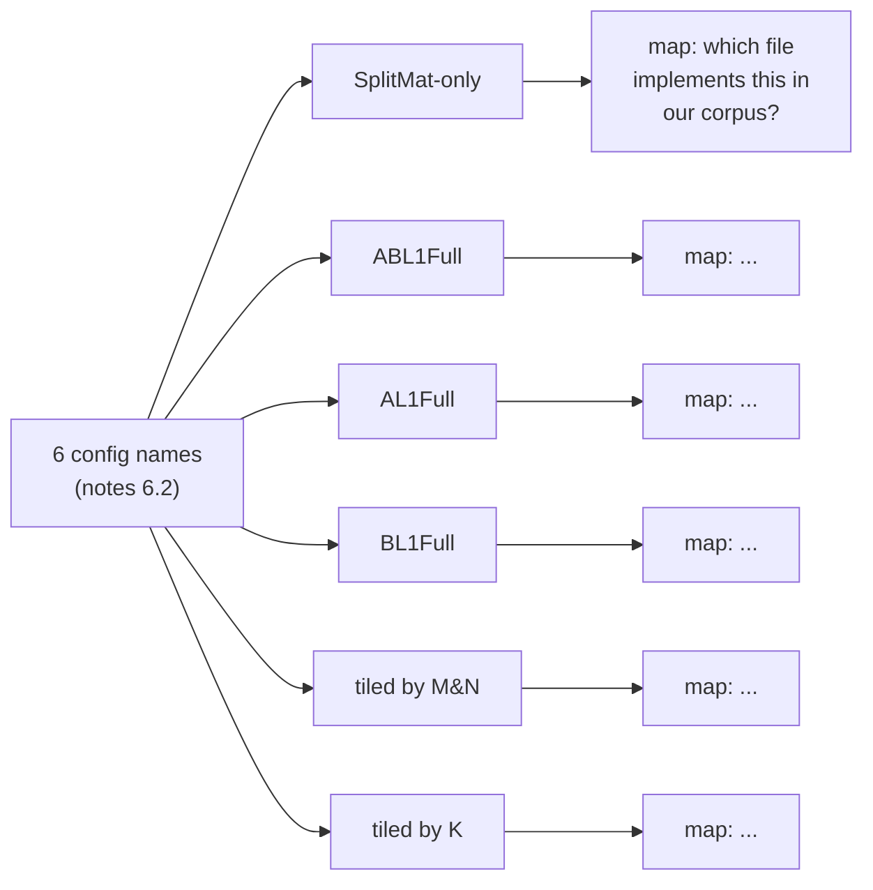

# Phase 4a — MatMul taxonomy inspection (only)

Drills into the taxonomy-only sub-phase of Phase 4 of [pyasc_skill_stack_quarterly_roadmap_aed2c154.plan.md](pyasc_skill_stack_quarterly_roadmap_aed2c154.plan.md). Sized at ~3 engineer-days across ~1 week. Phase 4b (goldens), Phase 4c (generative), Phase 4d (skill gaps) are **not** planned in this file — they become plannable only once Stage 4a.3's expressibility verdict exists.

## Outcome

After this sprint, [docs/matmul-taxonomy.md](../../docs/matmul-taxonomy.md) provides the verdict that the next three MatMul sprints depend on: for each of the six named tiling configurations from the notes, a concrete file path, a one-paragraph definition in the Phase 1 glossary vocabulary, the memory-level full-vs-tiled fingerprint, the required asc2 constructs, and a verdict. The flat "next-cells" list at the end of the doc is the input contract for Phase 4b's golden-and-cell sprint.

## Stage 4a.1 — Corpus survey (~0.5 ED)

The notes assume MatMul implementations live in `ops-math`, but a check of the local clone at `/home/aloschilov/workspace/ops-math` finds no MatMul kernel source — `ops-math` is a CANN math operator library (abs/add/cos/...), not the MatMul package. The actual MatMul material is distributed across:

- **pyasc tutorials.** [golden/tutorials/03_matmul_mix.py](../../golden/tutorials/03_matmul_mix.py), [04_matmul_cube_only.py](../../golden/tutorials/04_matmul_cube_only.py), [05_matmul_leakyrelu.py](../../golden/tutorials/05_matmul_leakyrelu.py). Three working tiers of complexity, already vendored in this repo.
- **asc2 unit tests.** `/home/aloschilov/workspace/pyasc/python/test/kernels/asc2/test_matmul_{numpy,simple,tiled,mnblock}.py`. Four files; the suffixes hint at the asc2-expressible MatMul configurations.
- **In-repo golden.** [golden/kernels/matmul_f16.py](../../golden/kernels/matmul_f16.py). The current "expressible today" baseline (SplitMat-only-equivalent: small fixed shapes, L0A/L0B, no L1 tile, no K loop).
- **ops-math architectural pattern.** `/home/aloschilov/workspace/ops-math/math/<op>/op_host/`, `op_kernel/`. Not MatMul itself; useful as the canonical op_host/op_kernel split + tiling-key pattern that the asc2 MatMul cells should mirror in their host-dispatcher cells.
- **Upstream CANN MatMul source.** Likely path: `cann/opp/built-in/op_impl/ai_core/tbe/impl/ops_nn/ascendc/mat_mul/mat_mul.cpp` (mirroring the rms_norm reference used in [.cursor/plans/rms_norm_platform_fix_and_gelu_tanh_9c16b5ec.plan.md](rms_norm_platform_fix_and_gelu_tanh_9c16b5ec.plan.md)). Not guaranteed to be in `/home/aloschilov/workspace` — check first; if absent, document the upstream URL and flag access as a Phase 4d-blocking dependency.

Produce a one-page index inside [docs/matmul-taxonomy.md](../../docs/matmul-taxonomy.md) scratch section listing every file inspected, its absolute path, and a one-sentence description.

Deliverable: scratch index (will be moved to a published appendix in Stage 4a.4); a Stage 4a.4 acceptance gate that the index has at least the 4 pyasc tutorial/test files + 1 golden + the ops-math architectural reference + a notation on the upstream CANN path.

## Stage 4a.2 — Map config names to code paths (~1 ED)

For each named configuration from the notes, find its canonical implementation and a usage example.



Concrete mapping conjectures (verify, do not commit until inspected):

- **SplitMat-only:** the simplest, no L1 tile, no K loop. Working hypothesis: [golden/kernels/matmul_f16.py](../../golden/kernels/matmul_f16.py) is this configuration. Confirm by reading the file and checking it: (a) loads A directly into L0A, (b) loads B directly into L0B, (c) calls `a @ b` once, (d) does not iterate over K.
- **ABL1Full:** both A and B fully fit in L1 before being staged to L0A/L0B. Working hypothesis: not present in [golden/](../../golden/), but the `test_matmul_tiled.py` file in `~/workspace/pyasc/python/test/kernels/asc2/` is a likely starting point.
- **AL1Full:** A fits in L1, B is tiled. Working hypothesis: not in this repo's goldens; check `test_matmul_*.py`.
- **BL1Full:** B fits in L1, A is tiled. Symmetric to AL1Full.
- **tiled by M&N:** the cube grid is partitioned by (m_tile, n_tile) on the host. Working hypothesis: [golden/tutorials/04_matmul_cube_only.py](../../golden/tutorials/04_matmul_cube_only.py) or `test_matmul_mnblock.py`.
- **tiled by K:** the K dimension is iterated; accumulator stays in L0C across iterations. Working hypothesis: [golden/tutorials/03_matmul_mix.py](../../golden/tutorials/03_matmul_mix.py) might exhibit a K loop; otherwise it lives in the upstream CANN reference only.

For each conjecture, record either "confirmed at file:line" or "not found in pyasc corpus; upstream CANN reference needed". For "upstream needed" rows, log the CANN path; if it is not reachable on the host, mark the row as a Phase 4d dependency.

Deliverable: a 6-row mapping in [docs/matmul-taxonomy.md](../../docs/matmul-taxonomy.md), each row with file:line citations or an upstream-needed flag.

## Stage 4a.3 — asc2 expressibility verdict per configuration (~1 ED)

For each of the 6 configurations, fill in a uniform descriptor block:

```yaml
config: SplitMat-only
simple_definition: |
  No L1 staging and no K loop. Both A and B are loaded directly from
  GM into L0A/L0B at the size that asc2.matmul consumes; the result
  is stored back from L0C in one shot. Smallest viable MatMul.
glossary_terms: [L0A, L0B, L0C, GM, tile, block_grid]
memory_level:
  A: L0A
  B: L0B
  L1: not_used
  accumulator: L0C (cube unit, f32)
shape_regime: fixed
minimal_shape_case:
  M: 16
  K: 16
  N: 16
asc2_constructs_required:
  - asc2.load(..., location=asc2.TileLocation.L0A)
  - asc2.load(..., location=asc2.TileLocation.L0B)
  - a @ b  # or asc2.matmul(a, b)
  - asc2.store
expressibility_verdict: expressible-today
evidence_for_verdict: golden/kernels/matmul_f16.py
notes: |
  Already the in-repo golden; today's matmul/f16 cell IS this
  configuration. No new cell needed for this config — Phase 4b
  starts from the next-easiest config.
```

Verdict values (one of three):

- `expressible-today` — the configuration runs as-is on the current asc2 surface. A new golden + cell is straightforward; Phase 4b will write it.
- `needs-skill-expansion` — asc2 supports the primitive, but the current [skills/pyasc-api-patterns/SKILL.md](../../skills/pyasc-api-patterns/SKILL.md) does not document the pattern; the agent will likely fail without a skill update. Phase 4d documents what the skill must say.
- `not-expressible-currently` — asc2 itself is missing a construct (e.g., no explicit L1 placement primitive, no `asc2.matmul_accumulate` for K-tiled iteration). Phase 4d documents the missing construct as a pyasc-side deferral.

Cross-check each verdict against the asc2 unit tests under `~/workspace/pyasc/python/test/kernels/asc2/test_matmul_*.py` — if a test exists, the configuration is at minimum `needs-skill-expansion`. If no test exists and no upstream CANN reference is reachable, the verdict is `not-expressible-currently` until proven otherwise.

Deliverable: 6 descriptor blocks completed in [docs/matmul-taxonomy.md](../../docs/matmul-taxonomy.md).

## Stage 4a.4 — Publish `docs/matmul-taxonomy.md` (~0.5 ED)

Final structure of the published doc:

1. Purpose + scope (one paragraph).
2. Inspection corpus (the Stage 4a.1 index).
3. Configuration → code path map (the Stage 4a.2 table).
4. Per-config descriptor (the six Stage 4a.3 blocks).
5. Next-cells list — flat ordered list of cells Phase 4b should add, ascending in asc2 difficulty (each list item: config name, dtype, minimal shape, verdict, required skill snippet).
6. Gaps — appendix listing constructs missing from [skills/pyasc-api-patterns/SKILL.md](../../skills/pyasc-api-patterns/SKILL.md) for every `needs-skill-expansion` row, and the pyasc/asc2 features missing for every `not-expressible-currently` row.
7. References — links to the upstream CANN paths used as definition sources.

The "next-cells" list is the interface contract with Phase 4b/4c/4d. They should not rediscover this list; they consume it.

Cross-link from the existing `matmul/f16` cell in [capabilities.yaml](../../capabilities.yaml) to the doc via a `taxonomy_ref: docs/matmul-taxonomy.md#splitmat-only` field (additive on schema v3, ignored by current readers).

Deliverable: [docs/matmul-taxonomy.md](../../docs/matmul-taxonomy.md) published; cross-link added; one local pr-gate run green (the cross-link is additive, no enforcement change).

## Definition of done for Phase 4a

- All 6 configurations mapped to either a concrete file in the corpus or to an upstream CANN reference (with Phase 4d-blocking note if the upstream is unreachable).
- All 6 configurations have a verdict in `{expressible-today, needs-skill-expansion, not-expressible-currently}`.
- "Next-cells" list emits at least one row per `expressible-today` and `needs-skill-expansion` configuration; "Gaps" section lists every missing construct.
- The doc cross-links to [docs/glossary.md](../../docs/glossary.md) (Phase 1) and is referenced from the `matmul/f16` cell in [capabilities.yaml](../../capabilities.yaml).
- Phase 4b can be planned from the published next-cells list without re-inspecting the corpus.

## Risks specific to Phase 4a

- **CANN MatMul source not locally reachable.** The upstream reference may not be checked out on this host. Mitigation: where the configuration is not present in the pyasc corpus, link to the public CANN gitcode URL and mark the row as "verification deferred to Phase 4d". Do not commit a guess.
- **Configuration names from notes may not map 1:1 to CANN tiling-key names.** "SplitMat-only" may be the notes' shorthand for a configuration CANN calls something else (e.g., "K-not-tiled, L1-not-used"). Mitigation: in the descriptor block, record both the notes name and the canonical CANN name once identified.
- **`test_matmul_tiled.py` ambiguity.** "tiled" in the file name may mean "tiled by M&N" or "tiled by K" or "L1 staging". Read the file before classifying, do not rely on the filename.
- **Verdict creep.** It is tempting to record "expressible-today" optimistically. Mitigation: a verdict of `expressible-today` requires a working unit test in `~/workspace/pyasc/python/test/kernels/asc2/`. Without one, the verdict drops to `needs-skill-expansion`.
- **Phase 4a is not Phase 4b.** This sprint does not write any new kernel or cell. Resist the temptation to fold the smallest "expressible-today" cell into this sprint — Phase 4b's plan needs to read the published taxonomy as input, and starting work in parallel will produce inconsistent direction.

## Deferred from Phase 4a (intentionally)

- **New goldens, new cells, new prompts.** Phase 4b.
- **Generative evidence runs on new cells.** Phase 4c.
- **Skill-snippet writeups for `needs-skill-expansion` configs.** Phase 4d; the "Gaps" appendix produced here is the input contract.
- **Performance comparisons across configurations.** Out of scope until the simulator emits perf numbers (Phase 7+).
- **Cross-platform expressibility.** Every cell targets `Ascend950PR_9599` today; cross-platform is a Phase 4 follow-up if needed.
