# Phase 6 — Model-size matrix

Drills into Phase 6 of [pyasc_skill_stack_quarterly_roadmap_aed2c154.plan.md](pyasc_skill_stack_quarterly_roadmap_aed2c154.plan.md) and only that phase. Sized at ~8 engineer-days across ~3 weeks (wall-clock bounded by local-model inference speed). Prerequisites: Phase 0 (4-leg harness), Phase 2 (canonical prompts), Phase 3 (baseline measured on cloud-default).

## Outcome

After this sprint, two questions have data-backed answers:

1. **Does phased decomposition help small models?** Run the 4 representative cells through `{local-llama-3.1-8b, local-qwen-coder-7b}` under 5 variants and chart pass-rate per variant. If phased helps small models, Phase 8 promotes phased as the local-stability-gate default.
2. **Does phased decomposition help large models?** Run cloud-default monolithic vs phased on the same 4 cells. Tokens, attempts, and (soft) quality-of-comments are tracked.

A side effect: [tests/tools/parameter_audit.py](../../tests/tools/parameter_audit.py) becomes the canonical kernel-parameter forensic tool, used by all later sprints to answer "what tile sizes did this model pick, and did they correlate with success?"

## Stage 6.1 — Phased decomposition prompt template (~1 ED)

Author [docs/phased-prompt.md](../../docs/phased-prompt.md) defining 6 phases. Each phase has: a single-question prompt, a required output artifact, a host-side verification gate before the next phase starts.

```mermaid
flowchart LR
    P1["Phase 1\nKernel body"] --> A1["@asc2.jit body\n(no params, no launcher)"]
    A1 --> P2["Phase 2\nParameters"]
    P2 --> A2["ConstExpr vs runtime\nplus kernel signature"]
    A2 --> P3["Phase 3\nHost launcher"]
    P3 --> A3["kernel[core_num](...) call\nplus np/torch buffer setup"]
    A3 --> P4["Phase 4\nTiling strategy"]
    P4 --> A4["TILE_SIZE, partitioning,\nasc2.range loop"]
    A4 --> P5["Phase 5\nTiling tuning"]
    P5 --> A5["chosen TILE_SIZE,\nblock_size values"]
    A5 --> P6["Phase 6\nVerification"]
    P6 --> A6["numpy/torch reference\nplus assert_allclose call"]
```



Phase-boundary outputs (what the agent must produce before advancing):

- Phase 1 → Phase 2: the `@asc2.jit`-decorated function body compiles without error against placeholder shape/dtype. Verifier: a thin static-check that `@asc2.jit` decoration is present and the function takes some pointer arguments.
- Phase 2 → Phase 3: signature names match a canonical pattern (`x_ptr, out_ptr, size, tile_size, tile_per_block`) and the `ConstExpr` annotations match the cell's `shape_regime`.
- Phase 3 → Phase 4: the host launcher script imports the kernel function and calls it with the expected core_num signature. The kernel imports cleanly under `python -c`.
- Phase 4 → Phase 5: the tiling uses `asc2.range(asc2.block_idx(), N, asc2.block_num())` and respects the cell's `partitioning` field.
- Phase 5 → Phase 6: `TILE_SIZE` is a multiple of 16 and `block_size` divides `num_rows` evenly (or `unsupported_regimes` declares otherwise).
- Phase 6: `np.testing.assert_allclose` / `torch.testing.assert_close` runs against a numpy/torch reference; the cell's `tolerance` matches.

If a phase verifier fails, the agent gets one retry within the phase. Two failures → that cell is recorded as failed at phase K (F1..F13 mapping captured per phase).

Deliverable: [docs/phased-prompt.md](../../docs/phased-prompt.md) (~120 lines) with one worked example for `gelu/f16` showing the agent's expected output per phase.

## Stage 6.2 — Implement `--phased` in the harness (~1 ED)

Concrete edits in [tests/tools/collect_generative_evidence.py](../../tests/tools/collect_generative_evidence.py).

- Add `--phased` flag. When set: replace the single opencode invocation with a 6-step pipeline (one per phase). Each step:
  - Constructs the phase-K prompt from a template in [docs/phased-prompt.md](../../docs/phased-prompt.md), substituting the cell's metadata + the prior phase's output.
  - Calls `opencode run` with `--dir <project>` and the phase-K prompt.
  - Reads the agent's artifact; runs the phase-K verifier.
  - On verifier pass: copies the artifact into the project and proceeds to phase K+1.
  - On verifier fail: re-invokes opencode once with a diagnostic prefix (`"The previous attempt failed at <verifier>; <message>; please retry"`); on second fail, records the per-phase failure and stops.
- Per-phase trajectories archived under [generative-archive/](../../generative-archive/)`<run-id>/phase-<n>/`.
- Per-phase tokens, elapsed, attempts captured. Evidence schema additions (additive on schema v3):

```yaml
phased:
  enabled: true
  phases:
    - n: 1
      name: kernel_body
      verifier_pass: true
      tokens: { input: ..., output: ..., total: ... }
      elapsed_s: 12.3
      attempts: 1
    # ... 5 more
  stopped_at_phase: null   # 6 = completed; 4 = failed at phase 4
```

- The evidence file's overall `tokens.total` aggregates per-phase totals.
- `--phased` requires `--protocol-id P3 | P6` (phased is a structural choice on top of a prompt variant). `--protocol-id P2` + `--phased` exits 1 (minimal prompts cannot drive phase-K outputs).

Deliverable: working `--phased` flag; one local dry-run on `gelu/f16` produces 6 phase artifacts + one evidence file with the `phased.phases` array filled.

## Stage 6.3 — Small-model matrix (~3 ED)

Run the 2 small profiles against 5 variants on 4 representative cells.

The 5 variants:

- `no-AGENTS.md`: protocol_id=P3, no AGENTS.md, monolithic. Already implementable via Phase 0 plus Stage 6.2's `--protocol-id P3 --no-agents-md`.
- `AGENTS.md`: protocol_id=P4, AGENTS.md mounted, monolithic. P4 already does this.
- `AGENTS.md + phased`: protocol_id=P4, monolithic→phased.
- `skills`: protocol_id=P6, skills on, monolithic.
- `skills + phased`: protocol_id=P6, skills on, phased.

The 4 cells:

- `abs/f16` (Tier 0): template-substitution; small models routinely fail here today.
- `reduce_sum/f32` (Tier 1): introduces accumulator + identity reasoning.
- `gelu/f16` (Tier 2): composed operator; tests pattern composition.
- `matmul/f16` (Tier 3): cube unit + L0A/L0B; the hardest small-model cell.

Matrix size: 2 profiles × 5 variants × 4 cells = 40 evidence files. Each takes 5–10 minutes of wall time on the local Ollama sidecar; the full matrix is ~6–10 hours.

Run on a workstation with the existing Ollama sidecar (the same setup [.github/workflows/ci.yml](../../.github/workflows/ci.yml) `local-stability-gate` uses). Do not run inside the GitHub Actions runner for this sprint — the 6–10 hour wall time exceeds typical job limits.

Per-cell metric capture: pass/fail, total tokens, attempts, `phased.stopped_at_phase` (which phase the small model failed at).

Deliverable: 40 evidence files committed to [evidence/](../../evidence/) with the small-profile suffixes; one CSV at [evidence/phase-6-small-matrix.csv](../../evidence/) for the findings doc.

## Stage 6.4 — Cloud-default monolithic vs phased (~2 ED)

Smaller matrix: 1 profile × 2 variants (`monolithic P6`, `phased P6`) × 4 cells = 8 evidence files. Run on `cloud-default`.

The interesting metrics here are subtler:

- `delta_pass` — usually near zero (cloud passes everything today). Not the headline.
- `delta_tokens` — does phased cost more or less? Hypothesis: phased uses more per-phase tokens but fewer total because it short-circuits on first phase failure.
- `delta_attempts` — does phased reduce repair loops?
- **Quality-of-comments** (soft signal from notes §4.3): manually grade each generated kernel's `design.md` + `verification.md` on a 1–5 scale (1 = boilerplate, 5 = mentions tiling rationale + dispatcher choice + tolerance choice). One grader, both runs blinded. Not a leaderboard metric — it is a side-channel observation captured in [evidence/phase-6-comment-quality.md](../../evidence/).

Deliverable: 8 evidence files; a one-page comparison in [evidence/phase-6-cloud-monolithic-vs-phased.md](../../evidence/).

## Stage 6.5 — `parameter_audit.py` (~1 ED)

A small standalone tool: given a directory of generated kernel.py files, extract the parameter choices the model made and report them.

Concrete fields (per notes §4.4):

- `TILE_SIZE` value(s).
- `CORE_NUM` value.
- `block_size`, `tile_per_block`.
- `unroll_factor` (if used).
- `parallel=True/False` flag location and value.
- `asc.ConstExpr` annotation count.
- Padding size if any (`OUT_PAD`, etc.).
- Accumulator dtype.
- Whether the kernel uses `asc2.range` with `(block_idx, N, block_num)` or with a literal range.

Implementation: AST walk on the kernel.py, with a small dictionary of known parameter names. No execution — pure static parsing. ~200 lines.

Aggregation: emit one JSON record per kernel + a summary aggregating mean / median / stddev per parameter, grouped by (model_profile, pass/fail). Output `evidence/parameter-audit.json` (additive; dashboard ignores it for now).

Cross-check: assert that `TILE_SIZE` extracted from the kernel matches the `tile_size` field if the cell metadata declared one (Phase 1's schema does not have a per-cell `tile_size`, but Phase 1 does have `padding`; cross-check that the kernel respects `padding`).

Deliverable: [tests/tools/parameter_audit.py](../../tests/tools/) with a small unit test fixture under [tests/unit/tools/](../../tests/unit/tools/); [evidence/parameter-audit.json](../../evidence/) generated from the Stage 6.3 + 6.4 kernels.

## Stage 6.6 — `docs/model-size-findings.md` (~1 ED)

The single deliverable readers actually consume.

Sections:

- §1 Phased decomposition for small models — pass-rate per variant per profile; "which phase did the small model fail at?" histogram.
- §2 Phased decomposition for large models — token cost, attempt count, comment-quality grade.
- §3 Parameter-choice patterns — typical TILE_SIZE / CORE_NUM by model class; correlation with pass/fail.
- §4 Conclusions:
  - If phased ≥ +20pp on small models for ≥3 of 4 cells, **recommend** promoting phased mode to the `local-stability-gate` default. The actual promotion is a Phase 8 follow-up; Phase 6 only recommends.
  - If phased is a wash or negative on large models, **recommend** keeping monolithic for `cloud-default`.
  - If parameter audit shows small models consistently pick TILE_SIZE values that don't align with the cell's shape, **recommend** adding a `recommended_tile_size` field per cell (Phase 7 schema addition).
- §5 Outstanding questions for follow-up sprints.

Deliverable: [docs/model-size-findings.md](../../docs/) committed; one short note appended to [docs/evaluation-methodology.md](../../docs/evaluation-methodology.md) §"Local-model interpretation" pointing at the new findings.

## Definition of done for Phase 6

- [docs/phased-prompt.md](../../docs/) and [docs/model-size-findings.md](../../docs/) published.
- `--phased` flag works end-to-end; 6 phase artifacts produced per run.
- 40 small-model evidence files + 8 cloud-default evidence files in [evidence/](../../evidence/).
- [tests/tools/parameter_audit.py](../../tests/tools/) committed with a unit test.
- [evidence/parameter-audit.json](../../evidence/) populated.
- Recommendations in §4 either accepted (Phase 8 commits) or explicitly rejected with rationale.

## Risks specific to Phase 6

- **Local Ollama wall-clock.** 6–10 hours per matrix run on a workstation; the full Stage 6.3 plus stability re-runs can consume ~30 wall-clock hours. Mitigation: do not couple this to a CI deadline; treat it as a manual sprint with checkpointed evidence files.
- **Phased verifier brittleness.** A too-strict phase boundary verifier (Stage 6.1) will mis-classify recoverable agent output as failure. Mitigation: each verifier offers one retry; phase-failure rate >50% across all cells flags the verifier itself as too strict.
- **Comment-quality grading subjectivity.** Stage 6.4's 1–5 grade is a single-grader signal. Mitigation: publish the grading rubric (criteria for each integer) and the per-kernel grades verbatim so a future second grader can re-grade without context loss.
- **Small-model recommendations risk over-fitting to today's snapshot.** llama-3.1-8b and qwen-coder-7b are two specific snapshots; the findings doc must say "for these two models in May 2026, …" rather than "for small models in general, …".
- **Parameter audit AST drift.** Generated kernels may use idioms `parameter_audit.py` doesn't recognize. Mitigation: a "unmatched" bucket counts kernels the audit could not classify; if that bucket is >10%, expand the patterns.
- **Phase 5 dependency.** If Phase 5 invalidated a tail mechanism that small models nonetheless try to use, the phase-6 verifier "Phase 5 tiling-tuning gate" should know about the do-not-use list; otherwise small models will fail at phase 5 for irrelevant reasons.

## Deferred from Phase 6 (intentionally)

- **Promoting phased to default for `local-stability-gate`.** Phase 8 decides; Phase 6 only recommends.
- **Adding `recommended_tile_size` to capabilities.yaml.** Phase 7 schema addition if the §4 recommendation lands.
- **Cross-quarter model snapshots.** Re-running Stage 6.3 on a future llama version is a follow-up sprint, not part of this quarter.
- **Performance-per-model comparison.** Once the simulator emits runtime numbers (Phase 7+), revisit.
- **3rd small model.** A third snapshot would strengthen claims but doubles the wall-clock; defer until needed.
