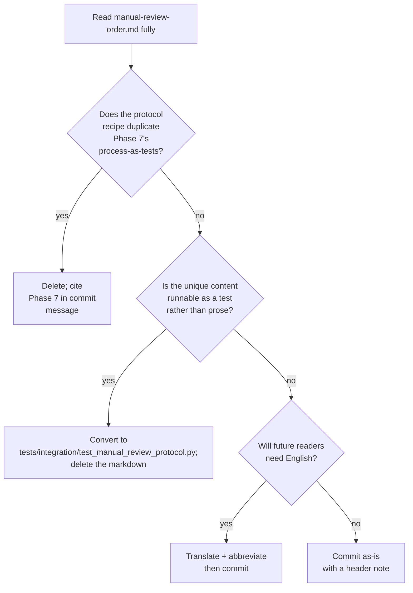

# Phase 8 — Cleanup and quarter retrospective

Drills into Phase 8 of [pyasc_skill_stack_quarterly_roadmap_aed2c154.plan.md](pyasc_skill_stack_quarterly_roadmap_aed2c154.plan.md) and only that phase. Sized at ~3 engineer-days across ~1 week. Lands last; the only sprint that explicitly references every other phase's output.

## Precision audit revision (2026-05-22)

The 2026-05-22 audit found a large amount of uncommitted worktree state. Stage 8.3 already enumerated most of these items, but the partition between "Phase 0/1 implementation work" (commit as part of those phases) and "unrelated platform/setup work" (Phase 8's job) is now made explicit:

- Phase 0/1 implementation work — covered by [phase_0_protocol_aware_harness.plan.md](phase_0_protocol_aware_harness.plan.md) Stage 0.0 Groups A and B; *not* this plan's responsibility.
- "Group C" — unrelated platform/setup work — IS this plan's responsibility (Stage 8.3 below).
- New leftovers found during the audit (not previously listed):
  - `.cursor/plans/rms_norm_platform_fix_and_gelu_tanh_9c16b5ec.plan.md` (untracked) — the historical plan record for the rms_norm + gelu/tanh fix. Should be committed for posterity, not deleted.
  - `docs/manual-review-order.md` (untracked) — Stage 8.1 already handles this.

Stage 8.3's file list below is also explicitly cross-referenced as "Group C" from Phase 0 Stage 0.0.

## Outcome

After this sprint, every loose end the quarter accumulated is either resolved or has a documented owner and date. The git tree is clean. The deferred decisions from Phase 1 (ReLU), Phase 5 (split-row softmax), and Phase 6 (phased default, recommended_tile_size) are finalized. [docs/quarter-retrospective-q1.md](../../docs/) is the single document a future reader opens to learn what the quarter measured and why.

## Stage 8.1 — Triage `docs/manual-review-order.md` (~0.5 ED)

The file is currently untracked, Russian-language, ~340 lines, written as a manual-review protocol for the legacy `asc` v1 stack but updated to acknowledge the asc2-current world. Three viable resolutions:

- **Commit as-is, with a header note.** Add a 3-line header to the top stating that this document is a historical manual-review protocol from May 2026, retained as-is to preserve the original author's intent; readers consult the asc2-aware sections only. Suitable if the file is institutionally valuable (it contains a step-by-step audit recipe that Phase 3's findings doc cites implicitly).
- **Translate + abbreviate + commit.** Translate to English, trim from ~340 lines to ~100 lines, focused on the asc2 sections only. Suitable if non-Russian-speakers in the future will need to use the protocol.
- **Convert to integration test.** The protocol is essentially "run these 7 checks in order before trusting a generative-cycle claim." Re-implement as [tests/integration/test_manual_review_protocol.py](../../tests/integration/) that runs each check, halting on first failure with a clear "do not proceed to step N+1 until step N passes" message. The original document is deleted, the test takes its place.
- **Delete.** If the protocol's recipe is superseded by Phase 7's `tests/integration/test_process_as_tests.py` plus the per-phase integration tests across the quarter, the document is dead weight.

Decision tree:

Deliverable: one of the four outcomes, with the rationale captured in the commit message. The git tree no longer has `??` for this path.

## Stage 8.2 — Finalize ReLU + split-row softmax cell decisions (~0.5 ED)

### ReLU

Phase 1 recommended closing as covered-by-pattern via `abs.representative_of: [..., relu, ...]` plus a `coverage_note` field on the `abs` operation. This recommendation stays; Phase 8 simply confirms by:

- Reading the post-Phase-1 [capabilities.yaml](../../capabilities.yaml) to verify the `coverage_note` is present and references `representative_of`.
- Cross-checking that no other deferred-list (in any per-phase plan or doc/) still lists "standalone ReLU cell" as a follow-up.
- Updating [docs/quarter-retrospective-q1.md](../../docs/) §"What we deferred and why" with the final ReLU position.

### Split-row softmax

Phase 5's truth matrix decides this. Two scenarios:

- **Phase 5 found `asc2.mask` works as expected on `Ascend950PR_9599`.** Add a `softmax/f16/split_row` cell (a new dtype-suffixed cell name, not a new operation) with `tail_behavior: mask`, `partitioning: host_dispatcher`, `unsupported_regimes: []`. A golden kernel + generative cell can be planned for Q+1; Phase 8 only adds the cell metadata + a `pending` status so the dashboard surfaces the gap.
- **Phase 5 found `asc2.mask` is silently wrong or unsupported.** Keep split-row softmax as a `softmax/f16` `unsupported_regimes` entry. Document in [docs/quarter-retrospective-q1.md](../../docs/) why we did not add the cell this quarter.

Deliverable: ReLU decision confirmed in [capabilities.yaml](../../capabilities.yaml); split-row softmax cell either added (with `pending`) or explicitly deferred with a one-paragraph justification.

## Stage 8.3 — Git-status cleanup (~0.5 ED)

This is "Group C" from [phase_0_protocol_aware_harness.plan.md](phase_0_protocol_aware_harness.plan.md) Stage 0.0. Phase 0 and Phase 1 explicitly exclude these from their PRs so that the Phase 0/1 review remains focused. Resolve each item independently in Phase 8:

- **`.gitignore` (modified, +4 lines):** review the diff; commit if it tightens ignore rules sensibly, revert if it accidentally hides intended-to-be-tracked files.
- **`README.md` (modified, +31 lines):** the changes appear to be a host-deps + Docker quickstart refresh tied to `scripts/install-host-deps.sh` and the Dockerfile diffs. Commit as one logical unit with the install-host-deps + Dockerfile diff if the docs match the script behavior; revert otherwise.
- **`docker/Dockerfile` (modified, +31 lines) and `docker/Dockerfile.overlay` (modified, +27 lines):** review against the documented Docker image rebuild dates and Group C as a whole; commit as part of the docker-overlay update if the changes are coherent (likely the C310 simulator migration referenced in [docs/perf-methodology/](../../docs/perf-methodology/)), revert if drift.
- **`docker/pyasc-overlay/asc_C/{aarch64,x86_64}/README.md` (untracked):** these explain the per-arch overlay binary layout; commit alongside the Dockerfile diffs above.
- **`docker/pyasc-overlay/asc_changed/language/core/{ir_value,range}.py` (deleted-tracked):** if these were intentional deletions during the asc2 migration (likely — the overlay no longer ships these shims), commit the deletion; otherwise restore. Bundle with the Docker commit above.
- **`docs/cann-setup.md` (modified, +42 lines):** review against the host-deps + Dockerfile changes; commit if aligned with Group C as a whole.
- **`golden/docs/python-api/language/core.md` (deleted-tracked):** the asc1 docs were dropped from the golden snapshot; commit the deletion with a one-line rationale ("asc1 docs removed; agent never reads asc1 surface anymore").
- **`scripts/install-host-deps.sh` (untracked):** referenced in the README diff above; commit as the head of the Group C stack.
- **`skills/pyasc-env-check/SKILL.md` (modified, +1 line):** the post-rms_norm-fix env-check update; commit standalone.
- **`.cursor/plans/rms_norm_platform_fix_and_gelu_tanh_9c16b5ec.plan.md` (untracked, NEW IN AUDIT):** historical plan record for the rms_norm/gelu fix; commit as-is into the .cursor/plans/ tree alongside the other plan files, with a `docs(plans):` commit message. Do *not* delete (it is the record of work that landed earlier this quarter).

Suggested commit grouping (avoid one giant "chore: cleanup" commit; future-blame stays useful):

1. `chore(scripts): add install-host-deps.sh host bootstrap helper` (scripts/install-host-deps.sh + README.md hunks that reference it).
2. `feat(docker): C310 overlay sync — drop ir_value/range shims and add per-arch READMEs` (docker/Dockerfile + Dockerfile.overlay + docker/pyasc-overlay/* changes + the two deletions).
3. `docs(cann-setup): align host-deps section with install-host-deps.sh` (docs/cann-setup.md).
4. `chore(golden): drop asc1 language/core docs (no longer referenced)` (golden/docs/python-api/language/core.md deletion).
5. `chore(skills): refresh pyasc-env-check post-rms_norm-fix` (skills/pyasc-env-check/SKILL.md).
6. `chore(gitignore): tighten ignore rules` (.gitignore).
7. `docs(plans): commit historical rms_norm + gelu/tanh plan record` (.cursor/plans/rms_norm_platform_fix_and_gelu_tanh_9c16b5ec.plan.md).

The final state: `git status --porcelain` returns zero lines (modulo the active branch's intentional new work).

Deliverable: a short stack of focused commits per the grouping above; `git status` reads clean afterwards.

## Stage 8.4 — Promote Phase 6 recommendations (~0.5 ED)

Phase 6's [docs/model-size-findings.md](../../docs/) ends with §4 "Conclusions" — three potential recommendations. Phase 8 acts on each:

- **Promote phased to `local-stability-gate` default.** If Phase 6 §4 recommended this:
  - Update [.github/workflows/ci.yml](../../.github/workflows/ci.yml) `local-stability-gate` matrix to add a `mode: [monolithic, phased]` axis, or replace monolithic with phased entirely (the Phase 6 recommendation will say which).
  - Document the wall-clock impact in the commit message; if the matrix expansion exceeds the runner's budget, route phased to the `protocol-full` weekly schedule introduced in Phase 3.
  - Re-run one nightly to confirm the change does not break the local-stability-gate.
- **Add `recommended_tile_size` per cell.** If Phase 6 §4 recommended this:
  - Add the field to the Phase 7 v4 additive schema (back-compat preserved).
  - Populate the field for all 12 cells from the Phase 6 parameter audit findings.
  - Update [tests/tools/check_capabilities.py](../../tests/tools/check_capabilities.py) to validate the field's value is consistent with the cell's shape (`recommended_tile_size` divides `shape[-1]` evenly).
- **Other recommendations.** If Phase 6 §4 produced surprise recommendations, evaluate each on its own; commit or document as deferred.

Deliverable: each Phase 6 recommendation has a "promoted" or "deferred with rationale" outcome in [docs/quarter-retrospective-q1.md](../../docs/).

## Stage 8.5 — Quarter retrospective (~1 ED)

Write [docs/quarter-retrospective-q1.md](../../docs/) — the single document a future reader opens to learn what the quarter accomplished and what changed our beliefs.

Structure:

- §1 **What was measured.** Reference Phase 0 plumbing, Phase 1 metadata, Phase 2 prompts, Phase 3 deltas, Phase 4a taxonomy, Phase 5 truth matrix, Phase 6 model-size findings, Phase 7 schema v4.
- §2 **What worked.** Cite specific deltas, taxonomy verdicts, F-code distributions, parameter-audit findings.
- §3 **What did not work.** Cells that flipped repeatedly across nightlies; mechanisms Phase 5 found `silently_wrong`; configurations Phase 4a classified `not-expressible-currently`.
- §4 **What changed our beliefs.** This is the most important section. Examples (subject to actual findings):
  - "Before Phase 3, the dashboard implied skill value was X pp; the post-Phase 3 measurement shows it is Y pp once AGENTS.md is accounted for."
  - "Before Phase 5, capabilities.yaml claimed N cells supported masked tail handling; after Phase 5, the supported count is M."
  - "Before Phase 6, we assumed phased decomposition helped small models uniformly; the data shows it helps for Tier ≤ K and hurts at Tier > K."
- §5 **Recommended for Q+1.** Concrete next steps; cite the deferred items from each phase's plan and prioritize.
- §6 **Methodological note.** Cite [docs/evaluation-methodology.md](../../docs/evaluation-methodology.md) (the contract this quarter conformed to), [docs/glossary.md](../../docs/glossary.md) (the vocabulary), [docs/prompt-template.md](../../docs/) (the prompts), [docs/tail-handling.md](../../docs/) (the verified mechanisms), [docs/matmul-taxonomy.md](../../docs/) (the MatMul roadmap), [docs/model-size-findings.md](../../docs/) (the small-model evidence).

The retrospective is honest about what *did not* change beliefs: if a Phase 3 nightly produced a `P4 − P3` near zero, that is a finding worth recording (the baseline AGENTS.md was essentially neutral), not an embarrassment.

Deliverable: [docs/quarter-retrospective-q1.md](../../docs/) committed; cross-linked from [README.md](../../README.md) §"How this matrix is evaluated".

## Definition of done for Phase 8

- [docs/manual-review-order.md](../../docs/) has a resolved fate (committed / translated / converted / deleted).
- ReLU decision confirmed; split-row softmax decision finalized.
- `git status --porcelain` returns zero lines after this sprint's commits.
- Phase 6 recommendations either promoted (with CI / capabilities.yaml updates) or deferred with rationale.
- [docs/quarter-retrospective-q1.md](../../docs/) committed and cross-linked from [README.md](../../README.md).
- All per-phase plan files in [.cursor/plans/](.cursor/plans/) referenced from the retrospective so future readers can drill down.

## Risks specific to Phase 8

- **Premature closure.** Stage 8.2 closes split-row softmax based on Phase 5's verdict; if Phase 5's truth matrix is itself noisy (Stage 5.4 risk), the decision propagates noise. Mitigation: the decision must cite a specific row in [evidence/probes/tail/matrix.yaml](../../evidence/probes/tail/) with a `noisy` flag absent.
- **Retrospective bias.** The author of the retrospective is also the author of the per-phase plans; selection bias is real. Mitigation: §4 "What changed our beliefs" must cite specific dashboard numbers from before-and-after each phase, not narrative claims.
- **`git status` resolution drift.** Some of the items in Stage 8.3 may have already been resolved in earlier sprints (e.g., `scripts/install-host-deps.sh` was committed in the README.md update). Mitigation: re-read `git status` before staging, do not work from the old list.
- **CI churn from Stage 8.4.** Promoting phased to local-stability-gate default and re-running a nightly to verify is ~3 wall-clock hours, plus a re-rerun if anything breaks. Budget for it.
- **Untranslated docs/manual-review-order.md as-is.** If §1 picks "commit as-is", a non-Russian-speaking team member six months later cannot use the document. Mitigation: even when committing as-is, prepend a 3-line English header summary so the document is at least navigable.

## Deferred from Phase 8 (intentionally)

- **Q+1 sprint planning.** The retrospective recommends; Q+1 plans are written separately.
- **v3 evidence retirement.** Phase 7 keeps v3 emission for one quarter; Phase 8 does not retire it.
- **Cross-team protocol harmonization.** Aligning the pyasc-skill-stack evaluation framework with sibling teams' frameworks is out of scope; Phase 8 only documents this repo's framework.
- **New operator coverage.** Adding new operations (besides the deferred ReLU and split-row softmax decisions) is a Q+1 sprint.
- **Cloud-default model upgrade.** Locking to the May-2026 cloud-default model snapshot is documented but not refreshed; Q+1 sprint if needed.
