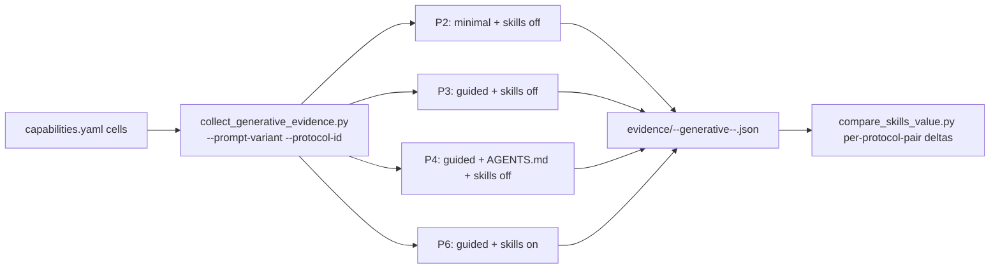
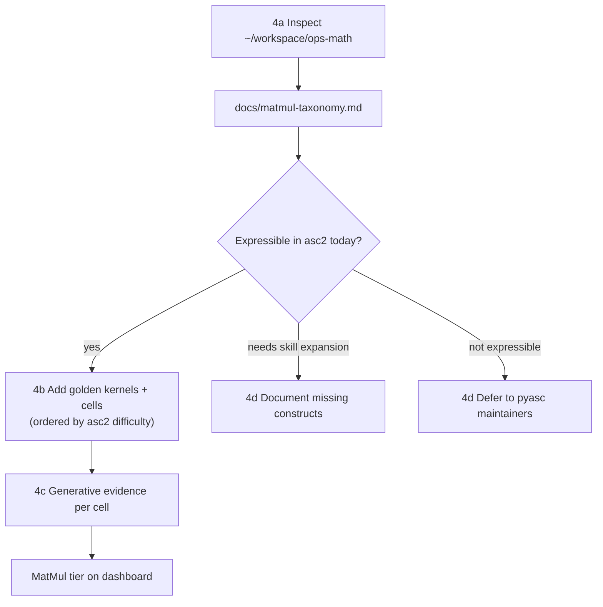

# PyAsc Skill Stack Quarterly Roadmap

This is the prioritized plan requested by [2026-05-22 — PyAsc Skill Stack Evaluation Scope](file:///media/psf/articles-workspace/2026-05-22%20%E2%80%94%20PyAsc%20Skill%20Stack%20Evaluation%20Scope.md). Horizon: ~12 weeks. MatMul depth: full branch. Sized at ~55 engineer-days to leave slack.

## A. Executive summary

Do these three things first, in order:

1. **Plumbing (Phase 0).** Make the evaluation harness capable of expressing the protocol taxonomy already documented in [docs/evaluation-methodology.md](docs/evaluation-methodology.md). Today's "skills-off" leg is only *near* P3 and there is no AGENTS.md leg. Without P2/P3/P4/P6 as first-class legs we cannot separate "skill value" from "guided-prompt value" from "AGENTS.md value", which is the entire point of the experiment.
2. **Spec hygiene (Phases 1–2).** Each cell in [capabilities.yaml](capabilities.yaml) currently advertises shapes but says nothing about shape regime, reduce axis, identity, accumulator dtype, tail behavior, partitioning, or unsupported regimes. Adding this metadata is cheap and clarifies what the goldens actually prove. Pair it with a glossary + prompt template so prompts use one vocabulary.
3. **MatMul branch (Phase 4).** This is the largest single workstream and the one most likely to expose missing asc2 constructs. Start with a taxonomy inspection of [~/workspace/ops-math](file:///home/aloschilov/workspace/ops-math), then add cells in ascending difficulty.

Defer schema v4, the performance layer, standalone ReLU, split-row softmax, and the deeper model-size matrix until after Phases 0–3 land.

## B. Prioritized roadmap

(Bullet list instead of a table because the plan renderer does not show tables.)

- **P1 — Phase 0: Protocol-aware harness.** Why now: every measurement downstream depends on it. Dependencies: none. Estimate: ~5 ED. Evidence/DoD: `--prompt-variant` and `--protocol-id` flags on [tests/tools/collect_generative_evidence.py](tests/tools/collect_generative_evidence.py); CI matrix has 4 legs (off-minimal, off-guided, agents-md, on-guided); evidence filenames encode protocol; `compare_skills_value.py` aggregates per-protocol pair.
- **P2 — Phase 1: Cell-level spec hygiene.** Why now: cheap metadata work; unblocks honest prompt rewriting. Dependencies: none (parallel to Phase 0). Estimate: ~5 ED. Evidence/DoD: new fields populated for all 12 cells in [capabilities.yaml](capabilities.yaml); [tests/tools/check_capabilities.py](tests/tools/check_capabilities.py) validates them; one-page glossary at `docs/glossary.md`.
- **P3 — Phase 2: Prompt methodology rewrite.** Why now: spec metadata only pays off if prompts read it. Dependencies: Phase 1 glossary. Estimate: ~4 ED. Evidence/DoD: `docs/prompt-template.md`; all 12 cells re-run through nightly with new prompts; no protocol regressions.
- **P4 — Phase 3: AGENTS.md baseline + token decomposition.** Why now: first time the "skill value" delta is rigorously isolated. Dependencies: Phase 0 (protocol field), Phase 2 (stable prompts). Estimate: ~5 ED. Evidence/DoD: ~48 new evidence files on `cloud-default` (12 cells × 4 legs); dashboard panel showing `P3−P2`, `P4−P3`, `P6−P4`, `P5−P2`.
- **P5 — Phase 4: MatMul branch (full).** Why now: highest-information capability; tests where the skill stack actually has leverage. Dependencies: Phase 0–2. Estimate: ~12 ED. Evidence/DoD: `docs/matmul-taxonomy.md` covering SplitMat-only, ABL1Full, AL1Full, BL1Full, tiled-MN, tiled-K; new golden kernels + cells for every config marked "expressible today"; explicit "not expressible / needs skill expansion" list with required asc2 constructs.
- **P6 — Phase 5: Tail/mask investigation.** Why now: unblocks honest `shape_regime` claims. Dependencies: Phase 1 (regime metadata). Estimate: ~6 ED. Evidence/DoD: `docs/tail-handling.md` with verified probes for `asc2.mask`, `asc2.load(..., real_shape=...)`, partial `asc2.store`; updated guidance in [skills/pyasc-api-patterns/SKILL.md](skills/pyasc-api-patterns/SKILL.md); tightened `shape_regime` claims in [capabilities.yaml](capabilities.yaml).
- **P7 — Phase 6: Model-size matrix.** Why now: answers "do skills help small models or just big ones?". Dependencies: Phase 3 (4-leg harness), Phase 2 (stable prompts). Estimate: ~8 ED. Evidence/DoD: phased-decomposition prompt template; ~40 new evidence files across 2 small models × 5 variants × 4 cells; `docs/model-size-findings.md`; parameter-audit tool extracting TILE_SIZE, CORE_NUM, etc.
- **P8 — Phase 7: Schema v4 + failure taxonomy.** Why now: needed to lock in the rigor layer once data shape is stable. Dependencies: Phase 0–6 (don't churn schema during experiments). Estimate: ~7 ED. Evidence/DoD: collector emits `schema_version: "4"`, populated `protocol`, `model`, `agent`, `result.{artifact_found,artifact_accepted,...,failure_category}`; integration test enforces process-as-tests checklist.
- **P9 — Phase 8: Cleanup + retrospective.** Why now: close out untracked files, deferred decisions, quarter writeup. Dependencies: all prior. Estimate: ~3 ED. Evidence/DoD: triage of `docs/manual-review-order.md`, decision on standalone ReLU + split-row softmax cells, quarter retrospective.

## C. Experimental design (concrete variants)

Six measurement axes; the harness must support combinations of these.

- **Protocol id:** P2 (minimal, skills off) | P3 (guided, skills off) | P4 (skills off + AGENTS.md mounted) | P6 (guided, skills on).
- **Allowed context:** task prompt | + AGENTS.md | + golden docs (later) | + golden kernels (oracle-guided P7 only).
- **Model profile:** `cloud-default` | `local-llama-3.1-8b` | `local-qwen-coder-7b`.
- **Prompt structure:** monolithic | phased (6 phases: kernel body → params → host launcher → tiling strategy → tiling tuning → verification).
- **Cell selection:** one cell per tier — abs/f16 (Tier 0), reduce_sum/f32 (Tier 1), gelu/f16 (Tier 2), matmul/f16 (Tier 3).
- **Skill mode:** on | off (already wired; reinterpret as "skill set hash" once Phase 7 lands).

Comparisons of interest (drawn from [docs/evaluation-methodology.md](docs/evaluation-methodology.md) §"Comparisons of interest"):

- `P5 − P2` and `P6 − P4` quantify *skill-stack value*.
- `P3 − P2` quantifies *guided-prompt value*.
- `P4 − P3` quantifies *AGENTS.md value*.
- `monolithic vs phased` × `model size` quantifies *workflow decomposition value*.

Per cell, capture: total tokens, input/output split, attempts, repair loops, time-to-first-valid-run, time-to-pass, failure mode (F1..F13), parameter choices.

## D. Implementation stages

### Phase 0 — Protocol-aware harness (~5 ED)



- Add `--prompt-variant {minimal,guided,oracle-guided,human-assisted}` and `--protocol-id {P2,P3,P4,P6}` to [tests/tools/collect_generative_evidence.py](tests/tools/collect_generative_evidence.py).
- Add an `agents_md` skills-off leg that mounts `~/workspace/pyasc-fork/AGENTS.md` as an OpenCode context file.
- Extend evidence filename suffix to `(profile, protocol_id)`; keep current `(profile, skills_mode)` naming as a back-compat alias.
- Update [.github/workflows/ci.yml](.github/workflows/ci.yml) matrix to 4 legs.
- Update [tests/tools/compare_skills_value.py](tests/tools/compare_skills_value.py) to compute pairwise deltas across all 4 protocols, not just on/off.

### Phase 1 — Spec hygiene (~5 ED)

For each cell in [capabilities.yaml](capabilities.yaml), add:

```yaml
shape_regime: fixed | runtime_size_only | dynamic
reduce_axis: <int|null>
output_shape: <list|null>
accumulator_dtype: float16 | float32 | null
identity: 0 | 1 | -inf | +inf | null
tail_behavior: aligned_only | host_pad | mask | real_shape | unsupported
padding: <int|null>
partitioning: row_per_core | tile_per_core | block_grid | host_dispatcher
unsupported_regimes: [split_row, dynamic_d, ...]
```

Update [tests/tools/check_capabilities.py](tests/tools/check_capabilities.py) to require these fields. Add `docs/glossary.md` with the standard terms from notes §2.1. Add a non-obvious-constraint comment block at the top of each [golden/kernels/*.py](golden/kernels/) (alignment, UB/L1/L0 placement, dispatcher choice, simulator/platform assumptions).

### Phase 2 — Prompt methodology (~4 ED)

Define a single prompt template in `docs/prompt-template.md` whose required slots are: operator semantics, input shapes, output shape, dtype, layout, axis, tiling constraints, padding/tail behavior, accumulator dtype, tolerance, platform, build/run command, expected evidence artifact. Rewrite every cell's `prompt`, `prompt_variants.minimal`, `prompt_variants.guided` to match. Re-run the nightly to confirm no protocol regressions.

### Phase 3 — AGENTS.md baseline + token decomposition (~5 ED)

Run `cloud-default × 12 cells × {P2, P3, P4, P6}`. Extend [tests/tools/compare_skills_value.py](tests/tools/compare_skills_value.py) and [tests/tools/generate_dashboard.py](tests/tools/generate_dashboard.py) to render: per-protocol pass-rate; per-protocol-pair `Δ pass`, `Δ tokens`, `Δ attempts`, `Δ time-to-pass`. Add a "skill stack value decomposition" panel showing the 4 deltas listed in §C.

### Phase 4 — MatMul branch (~12 ED, three sub-phases)



- **4a Taxonomy (~3 ED).** Walk [~/workspace/ops-math](file:///home/aloschilov/workspace/ops-math) (`math/`, `examples/`, `tests/` subtrees) to identify each configuration: SplitMat-only, ABL1Full, AL1Full, BL1Full, tiled-by-MN, tiled-by-K. For each: file paths, simple definition in glossary terms, what memory level is full vs tiled, minimal shape case, required asc2 constructs, expressibility verdict.
- **4b Goldens + cells (~4 ED).** Add one golden + one cell per "expressible today" configuration. Start with SplitMat-only (closest to the existing [golden/kernels/matmul_f16.py](golden/kernels/matmul_f16.py)). Order subsequent additions by ascending asc2 complexity. Each cell follows the Phase 1 metadata schema and the Phase 2 prompt template.
- **4c Generative (~3 ED).** Run the 4-protocol matrix on each new cell on `cloud-default`. Capture which configurations fail under skills-off but pass under skills-on (the strongest "skill value" claim we can make).
- **4d Gaps (~2 ED).** For "needs skill expansion" cases, write the missing snippet (cube/tiling pattern, L0A/L0B placement, tiling-key dispatch) into [skills/pyasc-api-patterns/SKILL.md](skills/pyasc-api-patterns/SKILL.md). For "not expressible" cases, write a one-paragraph deferral with the missing pyasc/asc2 construct.

### Phase 5 — Tail/mask investigation (~6 ED)

Write six micro-probes:

- `asc2.mask` on vector op (aligned, tail-only, full-tile).
- `asc2.load(..., real_shape=...)` with tail.
- Partial `asc2.store` to GM with tail.
- Same three probes on `Ascend910B1` and `Ascend950PR_9599`.

Publish `docs/tail-handling.md` with: verified mechanism per tile boundary; when to mask, when to pad, when to reject. Update [skills/pyasc-api-patterns/SKILL.md](skills/pyasc-api-patterns/SKILL.md). Revisit the [golden/kernels/rms_norm_f16.py](golden/kernels/rms_norm_f16.py) / [_f32.py](golden/kernels/rms_norm_f32.py) `split_d` path to confirm it uses the mechanism that turned out to be correct. Tighten `shape_regime` claims in `capabilities.yaml` for any cell that was over-claiming.

### Phase 6 — Model-size matrix (~8 ED)

- **6a (~2 ED).** Implement a phased decomposition prompt template (`docs/phased-prompt.md`) with 6 phases (kernel body / params / host launcher / tiling strategy / tiling tuning / verification).
- **6b (~3 ED).** Run small models `{local-llama-3.1-8b, local-qwen-coder-7b}` × `{no AGENTS.md, AGENTS.md, AGENTS.md + phased, skills, skills + phased}` on 4 representative cells (abs/f16, reduce_sum/f32, gelu/f16, matmul/f16).
- **6c (~2 ED).** Run `cloud-default × {monolithic, phased}` on the same 4 cells.
- **6d (~1 ED).** Write `tests/tools/parameter_audit.py` extracting `TILE_SIZE`, `CORE_NUM`, `block_size`, `tile_per_block`, `unroll_factor`, `parallel`, `asc.ConstExpr` usage from generated kernels; aggregate per model class and per pass/fail.
- Publish `docs/model-size-findings.md`.

### Phase 7 — Schema v4 + failure taxonomy (~7 ED)

- Emit `schema_version: "4"` from [tests/tools/collect_generative_evidence.py](tests/tools/collect_generative_evidence.py). Populate `protocol.{id,name,prompt_variant,skills_enabled,skill_set_hash,allowed_context}`, `model.{provider,model_id,model_version_or_date,temperature,seed}`, `agent.{harness,harness_version,tools_allowed,max_attempts,timeout_s}`, `result.{artifact_found,artifact_accepted,agent_clean_completion,timeout_after_success,static_verify,jit_verify,simulator_verify,score,failure_category}`.
- Move the heuristic `_classify_failure_mode` from [tests/tools/compare_skills_value.py](tests/tools/compare_skills_value.py) into the collector and write `failure_category` directly (F1..F13).
- Add `tests/integration/test_process_as_tests.py` asserting that every nightly produces: prompt artifact, model identity, token capture, trajectory log, compile/test command record, archived generated code, evidence JSON, classified failure mode.
- `compare_skills_value.py` and `generate_dashboard.py` read v4 fields preferentially with v3 fallback (additive contract per [docs/evaluation-methodology.md](docs/evaluation-methodology.md) §"v3 -> v4 mapping").

### Phase 8 — Cleanup + retrospective (~3 ED)

- Decide on [docs/manual-review-order.md](docs/manual-review-order.md) (currently untracked, Russian-language): commit-as-is, translate, or convert into a runnable integration check.
- Decide on standalone ReLU cell — recommendation: close as covered-by-pattern via `abs` `representative_of`.
- Decide on split-row softmax cell — recommendation: add as a separate capability cell with `unsupported_regimes: []` after the tail/mask spike clarifies the mechanism.
- Resolve the deleted/untracked files in `git status` (`docker/pyasc-overlay/asc_changed/language/core/{ir_value,range}.py`, `golden/docs/python-api/language/core.md`, new `scripts/install-host-deps.sh`).
- Quarter retrospective: which protocol delta was largest, where small models broke, which MatMul config required the most skill expansion.

## E. Minimal first experiment

Run a single cell — `abs/float16` — on `cloud-default` under **four** protocol legs:

1. P2: skills-off, minimal prompt.
2. P3: skills-off, guided prompt (today's nearest leg).
3. P4: skills-off, AGENTS.md mounted.
4. P6: skills-on, guided prompt (today's nearest leg).

This is the smallest experiment that exercises Phase 0 plumbing + Phase 3 protocol deltas. Acceptance criteria:

- 4 evidence files exist with `protocol.id` correctly set.
- Each has populated tokens, agent.artifacts_found, kernel_path, verification.status.
- `compare_skills_value.py` emits per-cell `P3−P2`, `P4−P3`, `P5−P2` (null since P5 not run), `P6−P4` deltas without infra_fail markers.
- The trajectory archive under `evidence/trajectories/<run_id>/` contains the prompt artifact, the kernel.py, design.md, the OpenCode log, and the build/test command record.

Time budget: ~1 ED including harness wiring iteration. If this fails infra-wise, fix Phase 0 before scaling. If it succeeds, scale to the full 12 cells × 4 legs.

## F. Risks and unknowns

- **AGENTS.md leg may shrink the apparent skill delta.** Today's "skills-off" leg uses the legacy guided prompt, which is itself detailed. Once we measure `P4 − P3` (AGENTS.md alone), the residual `P6 − P4` ("real" skill value) may be smaller than the dashboard currently implies. This is intentional and must not be engineered around.
- **ops-math expressibility gap.** Several MatMul configurations may require asc2 features (explicit L1 tiling primitives, tiling-key dispatch, double-buffered cube/vector pipelines) that the current skill set does not document. Phase 4a's first deliverable is the triage list; do not commit to per-cell estimates until 4a is done.
- **C310 simulator platform constraints.** Only `Ascend950PR_9599` has the cube unit. Some ops-math configs require shapes/tilings that may not fit C310 UB/L0 budgets. Add `platform_required: Ascend950PR_9599` to MatMul cells (already done for the one existing matmul cell).
- **Token cost increase.** Moving from 2 legs to 4 legs is ~2× the OpenCode budget per nightly. Budget the CI matrix accordingly; consider running P2 and P4 weekly instead of nightly if budget binds.
- **Phased decomposition may not generalize.** The 6-phase template may help small models on Tier-0 ops but hurt them on Tier-3 (more state to track). Treat Phase 6 findings as conditional, not universal.
- **Tail/mask probes may fail on one platform but pass on the other.** That is the desired information; record it as platform-conditional guidance in `docs/tail-handling.md`, not a contradiction.
- **Schema v4 churn during experiments.** Do not bump the schema during Phases 3–6. Lock data shape, run experiments, then bump in Phase 7 with additive-only fields.
- **`asc2.tanh` precision on smaller dtypes.** The recent gelu/f32 plan switched to a tanh/Padé form; if tanh precision proves unstable for other ops (e.g., a future softmax variant), the same simulator-erf issue may resurface.

## G. Deferred work

Explicitly not in this quarter:

- **Performance layer** (`runtime_ms`, `speedup_vs_reference`, `correct_but_slow`). The C310 simulator does not yet emit reliable performance numbers per [docs/evaluation-methodology.md](docs/evaluation-methodology.md) §"Performance layer (planned)". Wait for perf-capable hardware/simulator.
- **Standalone ReLU cell.** Covered-by-pattern via `abs` and `leaky_relu`. Reopen only if a benchmarking cell is explicitly requested.
- **Standalone split-row softmax cell.** Add only after Phase 5 confirms the tile-streaming mechanism for full rows that exceed UB.
- **Dynamic-shape testing framework.** Current cells fix shapes per cell. Truly dynamic-shape support across cells is a separate workstream beyond this quarter.
- **Oracle-guided (P7) and human-assisted (P8) legs.** Documented in [docs/evaluation-methodology.md](docs/evaluation-methodology.md) but explicitly not part of the autonomous leaderboard. Add only as diagnostic upper bounds when needed.
- **Migration of the dashboard to view C (model/profile capability matrix).** Documented in [docs/evaluation-methodology.md](docs/evaluation-methodology.md) §"Three matrix views" but not required by the notes; defer.
- **CANN/`pyasc` source-level patches.** Out of scope for the skill stack; surface as deferral entries in Phase 4d.

## Final cross-check against the notes

- **§1 spec hygiene** → Phase 1 + glossary in Phase 2 + tail/mask in Phase 5.
- **§2 prompt methodology** → Phase 2.
- **§3 fair baseline** → Phase 0 + Phase 3.
- **§4 model-size** → Phase 6.
- **§5 process-as-tests** → Phase 0 (artifacts), Phase 7 (integration test).
- **§6 MatMul** → Phase 4.
- **§7 tail/mask** → Phase 5.
- **§8 metrics** → covered by Phase 7 schema v4 fields + Phase 6 parameter audit.
- **§9 clean action order** → matches the phase numbering above with one swap (notes put MatMul at #6 and tail/mask at #7; this plan moves MatMul to Phase 4 because §9's stated "minimal first MatMul cell" depends on the Phase 0 protocol harness being in place, but does not depend on the tail/mask spike — and tail/mask is itself most valuable *after* Phase 1's `shape_regime` claims expose where the truth needs verifying).
