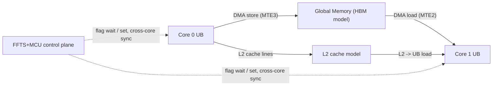

# Ticks Calculation Methodology (camodel / `Ascend950PR_9599`)

This document explains what the `Total tick:` and `Model RUN TIME:` lines
that the CANN simulator (the **camodel** — short for "cycle-accurate model")
emit on stdout actually measure, what they do **not** measure, how to read
them when a Python process launches more than one kernel, how the camodel
accounts for data transfer between AI cores, and how to reproduce a
single-kernel benchmark by hand. All numbers in this doc come from the
`ghcr.io/aloschilov/pyasc-sim:py3.11` image with CANN 9.0.0, on
`Ascend950PR_9599` (C310 / `arch35`) — the only platform the skill stack
targets ([CI dispatch](../../.github/workflows/ci.yml),
[migration commit](https://github.com/aloschilov/pyasc-skill-stack/commit/d7dfbcb)).

## TL;DR

- **`Total tick: N`** is the camodel's internal `tm_engine::tm_time()` cycle
  counter at process exit. It is **monotonic across the entire process** and
  ticks only while the simulator is simulating AI core hardware. Python
  imports, JIT compile, host-side numpy/torch, etc. **do not advance it**.
- **`Model RUN TIME: M ms`** is the host wall clock the camodel host
  process spent in its simulation loop. It scales with how much work the
  camodel simulated in this process, but it is **not** the per-launch
  cycle count and **not** apples-to-apples with NPU wall clock.
- For multi-launch scripts (e.g. `rms_norm_*.py`'s `run_kernel`, which
  invokes both branches; `matmul_f16.py`'s two test cases), `Total tick:`
  is the **sum** across all launches, not the cost of any one launch. The
  camodel's per-launch `block_start` / `block_end` infos are how you
  separate them.
- **Inter-core data transfer** through GM, L2, or FFTS+MCU is part of the
  simulator's cycle accounting — DMA / scalar PIPE_S sync / `pipe_barrier`
  cycles all advance the same `tm_time()` counter.

## 1. What "tick" actually means

The simulator binary (in
`/usr/local/Ascend/cann-9.0.0-beta.2/tools/simulator/Ascend950PR_9599/lib/`)
exposes a tick-model engine in C++. The relevant symbols, found via
`strings`/`nm` on the shipped libraries:

| Symbol / library | Meaning |
|---|---|
| `tm_engine::tm_time()` in `libpem_davinci.so` | Reads the camodel's monotonic cycle counter. The Python overlay binds this in [docker/pyasc-overlay/asc_changed/lib/runtime/interface.py](../../docker/pyasc-overlay/asc_changed/lib/runtime/interface.py) line 411 (`current_tick()`). |
| `[%s] Total tick: %lu` in `libmodel_top.so` | Format string that prints the final value of `tm_time()` to stdout when the camodel shuts down. |
| `Model RUN TIME: ` in `libmodel_top.so` | Adjacent print that records host wall clock spent in the simulator. |
| `stars_top::tick()`, `reg_ffts_plus_mcu_tick_cb` in `libmodel_top.so` | Per-cycle hooks for the FFTS+MCU control plane (the cross-core scheduler). |
| `[info] [<tick>] [block_start] AIV/AIC ...` log line | Per-block lifecycle event with the value of `tm_time()` at the time the simulated AI core picked up the kernel. Same goes for `[block_end]`. |

The "tick" is **simulated AI core cycles**, not host CPU cycles. At the
camodel's wall-clock fixed-point of 50 MHz (per the upstream API spec at
[golden/docs/python-api/language/generated/asc.language.basic.get_system_cycle.md](../../golden/docs/python-api/language/generated/asc.language.basic.get_system_cycle.md)),
1 tick ≈ 20 ns of "device time". The same counter is reachable from inside
a kernel via `asc.get_system_cycle()` and from Python via
`asc.runtime.lib.runtime.current_tick()`.

## 2. Verification: JIT compile time is **not** counted in ticks

Earlier perf docs ([pr190-asc2-range-defaults-impact.md](../pr190-asc2-range-defaults-impact.md),
[pr190-asc2-range-c310-sweep.md](../pr190-asc2-range-c310-sweep.md))
captured `Total tick:` as the headline metric. There was a recurring concern
that for goldens decorated `@asc2.jit(always_compile=True)` (which forces a
full bisheng compile on every process launch), the printed tick might
silently fold in JIT compile cost. This section settles that empirically.

**Method.** Launch the same kernel three times in one Python process, with
`@asc2.jit` (default `always_compile=False`) so the asc.runtime cache is
exercised. Run 1 forces the full Python → MLIR → bisheng → object file →
elf compilation pipeline. Runs 2 and 3 are cache hits — no recompile, no
codegen, no link. Compare the per-launch tick deltas via the camodel's
`block_start` / `block_end` log lines.

**Result** (raw camodel output, 8 cores, `abs(x)` over `size=8192` fp16):

| Run | Block start tick | Block end tick (max) | Δ ticks (per launch) | Python wall (s) |
|---|---|---|---|---|
| 1 (full JIT compile) | 76 | 4 863 | **4 787** | 81.26 |
| 2 (cache hit) | 4 868 | 9 742 | **4 874** | 80.66 |
| 3 (cache hit) | 9 747 | 14 609 | **4 862** | 86.26 |

Cumulative `Total tick: 14 612` printed at process exit (matches the last
`block_end` plus a few cleanup ticks).

**Reading.** The per-launch tick deltas are 4 787, 4 874, 4 862 — a spread of
~1.8% (run-to-run camodel jitter). **Run 1 is not slower than runs 2 and 3.**
If JIT compile contaminated the simulator's tick counter, run 1 would have
to be visibly larger; instead it is the smallest of the three (within
noise). Python wall clock is largely insensitive to JIT vs. cache too —
the camodel host process is the dominant cost, not the Python compile pass.

This is consistent with the architecture: `tm_time()` is advanced inside
`libpem_davinci.so` only while the camodel is stepping simulated AI cores
through the kernel binary. The Python-side compile pipeline runs entirely
*before* `rt.launch_kernel` reaches `libruntime_camodel`, so it cannot
move the counter.

**Caveat.** This means `Total tick:` is independent of compile state on
the simulator. On real NPU hardware the analogous `msprof` cycle counters
are also kernel-execution-only, so the property holds there too — but the
host-side wall clock comparison is different on NPU because real DMA is
asynchronous (see [section 5](#5-host-wallclock-model-run-time-vs-ticks)).

## 3. Per-launch vs cumulative: a methodology trap

`Total tick:` is the camodel's value of `tm_time()` **at process exit**.
For a process that issues only one kernel launch (most elementwise / reduction
goldens), this happens to equal the per-launch tick count. For a process
that issues several launches (`rms_norm_f16.py`'s `run_kernel` exercises
both `_full_row_launch` and `_split_d_launch`; `matmul_f16.py` has two
test_cases) **the headline number is the running sum**, not the per-launch
cost.

The prior C310 sweep ([pr190-asc2-range-c310-sweep.md](../pr190-asc2-range-c310-sweep.md))
captured `Total tick:` as a single number per Docker run for this reason
— each cell ran the same `run_kernel` body, so the comparison was
internally consistent (apples-to-apples), but absolute numbers blend
multiple kernel calls.

If you need per-launch ticks, do not parse `Total tick:`. Instead parse
the camodel's `[block_start]` / `[block_end]` log lines and subtract:

```python
import re
START = re.compile(r"^\[info\] \[(\d+)\] \[block_start\]")
END   = re.compile(r"^\[info\] \[(\d+)\] \[block_end\]")
# Group block_start / block_end lines into launches; each launch has
# `core_num` block_starts followed by `core_num` block_ends. Per-launch
# tick = max(block_end) - min(block_start).
```

Or — the clean way — call `asc.runtime.lib.runtime.current_tick()` from
Python before and after each launch:

```python
from asc.runtime.lib import runtime as rt
t0 = rt.current_tick()
kernel[CORE_NUM](*args)
rt.synchronize()
t1 = rt.current_tick()
print(f"per-launch ticks: {t1 - t0}")
```

`current_tick()` returns `None` when not on Model backend (NPU does not
expose this counter through the same path).

## 4. Data transfer between AI cores

The camodel simulates the entire C310 datapath — local UB, L0A/L0B, L1,
L2, GM, the cube unit, and the FFTS+MCU control plane that sequences
work between cores. Data motion between AI cores happens through one of
three mechanisms, all of which advance `tm_time()`:



- **Producer-consumer through GM.** The most common pattern in our
  goldens. A core stores a tile to GM (MTE3 + DMA cycles) and another
  core later loads it (MTE2 + DMA cycles). Both transfers are modelled
  by `libmodel_top.so` as DMA engine cycles plus HBM bandwidth contention,
  and both add to `tm_time()`.
- **L2 cache hits.** When two cores read overlapping addresses within
  the L2 working set, the second read is modelled as an L2 hit (smaller
  cycle penalty than a GM round-trip). `Total tick:` sums both costs.
- **FFTS+MCU cross-core sync.** When a kernel uses `pipe_barrier`,
  `set_flag` / `wait_flag`, or higher-level constructs that produce them
  (e.g. RMSNorm split-D with a per-core `sum_sq` shared via UB), the
  camodel runs `stars_top::tick()` and the FFTS+MCU tick callback
  registered in `reg_ffts_plus_mcu_tick_cb` to advance the control-plane
  clock. Wait-for-flag stalls on a slow producer therefore appear as
  extra ticks on the consumer's `block_end` timestamp.

The headline implication: when an `asc2.range(..., parallel=True)` outer
loop distributes rows across cores (e.g. `rms_norm` row distribution), the
fastest core's `block_end` is *not* what `Total tick:` reflects — the
simulator runs until the slowest core's `block_end`. This is visible in
the verification log above: run 1's eight cores ended at ticks 4 533, 4 604,
4 651, 4 722, 4 729, 4 730, 4 803, **4 863** — the per-launch tick is
governed by the *slowest* core, exactly as it would be on real hardware.
The `Total tick:` thus already accounts for inter-core load imbalance —
no separate "data transfer" budget is needed.

## 5. Host wallclock (`Model RUN TIME:`) vs ticks

`Model RUN TIME:` is the host wallclock spent inside the camodel host
process's simulation loop. Two reasons it is **not** a substitute for
`Total tick:` when comparing kernel variants:

- The camodel runs in software on the CI runner's CPU. Its host wallclock
  per simulated tick varies with the runner's CPU frequency, with what
  else is happening on the box, and with the simulator's `--release`
  vs debug options at build time. Two cells with the same `Total tick:`
  can show different `Model RUN TIME:`.
- It includes camodel internals (event scheduling, log emission, Python
  callback overhead) that have nothing to do with the simulated kernel
  cost.

Use `Model RUN TIME:` as a sanity check (does this kernel run in seconds
or minutes?), and `Total tick:` (or per-launch deltas, see section 3) for
relative perf comparison.

## 6. Manual reproduction: benchmark a single kernel and shape

Recipe for reproducing a single-kernel tick measurement on
`Ascend950PR_9599` outside CI. Copy-paste from this section.

### 6.1. Prerequisites

- Docker, with permission to pull from `ghcr.io/aloschilov/pyasc-sim:py3.11`.
- A clone of this repo. The recipe assumes `$REPO=/path/to/pyasc-skill-stack`.

### 6.2. Run the existing golden as-is

For any of the 10 goldens:

```bash
cd "$REPO"
docker run --rm --ulimit nofile=65536:65536 \
  -v "$(pwd)":/workspace -w /workspace \
  ghcr.io/aloschilov/pyasc-sim:py3.11 \
  bash -c '
    export LD_LIBRARY_PATH="/usr/local/Ascend/cann-9.0.0-beta.2/tools/simulator/Ascend950PR_9599/lib:$LD_LIBRARY_PATH"
    export PYASC_DUMP_PATH=/tmp/pyasc-eval-dump
    python3.11 golden/kernels/<kernel>.py -r Model -v Ascend950PR_9599
  ' 2>&1 | tee /tmp/run.log

grep -E "Total tick|Model RUN TIME" /tmp/run.log
```

That gives you the cumulative `Total tick:` across every launch in the
kernel's `run_kernel` function. For elementwise / reduction / softmax this
is one launch; for `rms_norm_*` and `matmul_f16` it is several.

### 6.3. Per-shape, single-launch ticks

To measure exactly one kernel call at one shape, write a short driver that
calls `current_tick()` around the launch:

```python
# /tmp/probe_one_shot.py
import argparse, numpy as np
import asc, asc.runtime.config as config
import asc2
from asc.runtime.lib import runtime as rt

CORE_NUM, TILE_SIZE = 8, 128

@asc2.jit  # leave default cache; first-call compile happens once
def k(x_ptr: asc.GlobalAddress, out_ptr: asc.GlobalAddress,
      size: int, tile_size: asc.ConstExpr[int],
      tile_per_block: asc.ConstExpr[int]):
    x_gm = asc2.tensor(x_ptr, [size]); out_gm = asc2.tensor(out_ptr, [size])
    base = asc2.block_idx() * tile_size * tile_per_block
    for i in asc2.range(tile_per_block, unroll_factor=2, parallel=True):
        off = base + i * tile_size
        asc2.store(asc2.abs(asc2.load(x_gm, [tile_size], offsets=[off])),
                   out_gm, offsets=[off])

p = argparse.ArgumentParser()
p.add_argument("-r", default="Model"); p.add_argument("-v", default="Ascend950PR_9599")
p.add_argument("--size", type=int, default=8192)
a = p.parse_args()
config.set_platform(config.Backend(a.r), config.Platform(a.v))

x = (np.random.default_rng(2026).random(a.size, dtype=np.float32) * 2 - 1).astype(np.float16)
out = np.zeros_like(x)
tiles = a.size // TILE_SIZE

# Warm-up launch so JIT cache is populated; ignored from the headline number.
k[CORE_NUM](x, out, a.size, TILE_SIZE, tiles // CORE_NUM)
rt.synchronize()

# Measured launch.
t0 = rt.current_tick()
k[CORE_NUM](x, out, a.size, TILE_SIZE, tiles // CORE_NUM)
rt.synchronize()
t1 = rt.current_tick()
print(f"PER_LAUNCH_TICKS={t1 - t0}")
```

Run it through the same Docker command as section 6.2, swapping the
script. The `PER_LAUNCH_TICKS=` line is the clean number; `Total tick:`
at process exit will be roughly `t1 + cleanup ticks`.

### 6.4. Sweep one parameter

To answer "what does `unroll_factor` do for this kernel and shape?", reuse
the temp-file rewrite pattern from the C310 sweep. Either edit the kernel
in a temp copy and re-run section 6.3 across cells, or pass the parameter
through `asc.ConstExpr[int]` from the launcher and feed different values
in successive launches.

### 6.5. Reading the output

Useful patterns from `grep`:

```bash
grep "Total tick:"            # cumulative camodel tick at exit
grep "Model RUN TIME:"        # host wallclock inside camodel
grep "PER_LAUNCH_TICKS="      # custom probe output
grep -E "block_(start|end)"   # per-block lifecycle, lets you compute per-launch ticks
```

To compute per-launch ticks from `block_end` lines:

```bash
awk '/\[block_start\]/ { if (n[NR%CORE]==0) start[NR%CORE]=$2 }
     /\[block_end\]/   { end[NR%CORE]=$2 }
     END { ... }' /tmp/run.log
```

Or, more reliably, parse with the Python regex shown in section 3.

## 7. Caveats and gotchas

- **Single-shot per cell**. The simulator is deterministic in its scheduling
  model but the camodel host process is not bit-stable across runs (event
  ordering, page-fault patterns, CPU thermal throttling). The 1-2% spread
  in section 2's table is normal. For headline numbers prefer 3-run medians.
- **Simulator vs NPU**. The camodel is a cycle-*model*, not a cycle-*accurate*
  silicon emulator. Trends and cliffs map to real NPU behaviour; absolute
  cycle counts do not.
- **`always_compile=True` and probe contamination**. All goldens use
  `@asc2.jit(always_compile=True)`. This forces a fresh bisheng pass on
  every process launch, which lengthens Python wall clock but does **not**
  change ticks (verified in section 2). When writing your own probe,
  drop `always_compile=True` and use a warm-up launch (section 6.3) so
  the cache is populated before you read `current_tick()`.
- **Don't read `current_tick()` on NPU.** It returns `None` for non-Model
  backends ([interface.py:411](../../docker/pyasc-overlay/asc_changed/lib/runtime/interface.py)).
  Use `asc.get_system_cycle()` from inside a kernel for in-kernel cycle
  reads on real hardware.
- **Print order on shutdown.** The camodel emits `Model RUN TIME:` first
  and `Total tick:` second (verified in section 2's run). If you parse
  with a one-pass loop, both lines appear within a few lines of each
  other near the end of stdout — capture both before deciding which to use.

## 8. Cross-implementation comparison (pyasc vs hand-written AscendC)

Phase 11 compares a skill-stack-generated `pyasc` kernel against the
hand-written AscendC C++ reference in [`ops-math/math/`](/home/aloschilov/workspace/ops-math/math/)
for the *same op, dtype, and shape*, on the *same* camodel
(`Ascend950PR_9599`). The headline metric is

```
ratio = ref_ticks / gen_ticks        # >= 0.70 == within ~30% of hand-written
```

**Symmetry is the whole game.** To make the ratio meaningful both sides must
be measured identically:

- **Same camodel core.** ops-math builds with `--soc=ascend950`, whose
  simulator chip is `dav_3510`; pyasc pins the `Ascend950PR_9599` product.
  Both load a byte-identical `libmodel_top.so`, so cycles are comparable.
- **One launch per process, `Total tick`.** The AscendC reference issues a
  single `aclnn<Op>` launch, so its process-exit `Total tick` *is* the
  per-launch cost. To stay symmetric, the pyasc side is measured the same
  way: one launch per process, read `Total tick`, median of 3 processes —
  **not** the in-process `current_tick()` warm-up delta of §6.3. (Reason: the
  `always_compile=True` kernels are unstable across multiple launches in one
  process; a fresh process per launch sidesteps that and matches the
  reference's single-launch shape exactly.)
- **Same shape, honestly.** Pin both sides to the same shape (Phase 11 uses
  `[32,4096]`). Document any unavoidable `core_num`/tiling differences rather
  than engineering them away.
- **Launch/dispatch overhead dominates at demo sizes.** At `[32,4096]` a single
  elementwise launch is overwhelmingly fixed launch cost, so abs ref≈4346,
  add ref≈4283, reduce_sum ref≈8330 (the reduction does real per-row work).
  This makes the ratio a *fixed-overhead-inclusive* comparison, which is the
  honest thing to show for a single-launch demo.

Runners: [`tests/tools/perf/ascendc_ref_runner.py`](../../tests/tools/perf/ascendc_ref_runner.py)
(reference) and [`tests/tools/perf/pyasc_gen_runner.py`](../../tests/tools/perf/pyasc_gen_runner.py)
(generated); orchestrated by [`tests/tools/demo_vector_ops.py`](../../tests/tools/demo_vector_ops.py).
See [`docs/perf-vs-ascendc-demo.md`](../perf-vs-ascendc-demo.md) for the gate,
caveats, and the current cell status (including the generated-side codegen
blocker for multi-input/reduction kernels).
