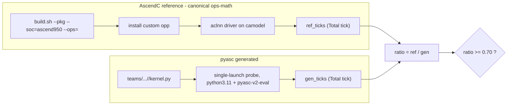

# Perf-vs-AscendC demo (Phase 11)

**Claim under test:** the skill stack auto-generates `pyasc` vector-only kernels
whose camodel tick count is within ~30% of the hand-written AscendC C++
reference in [`ops-math/math/`](/home/aloschilov/workspace/ops-math/math/).

**Gate:** `ratio = ref_ticks / gen_ticks >= 0.70`, both measured on camodel
`Ascend950PR_9599` at the same op/dtype/shape.

## Result (Phase 11b — live regen, all cells measured on camodel)

```
| cell                 | ref_ticks | gen_ticks | ratio | gate    |
|----------------------|-----------|-----------|-------|---------|
| abs/float16          |      4349 |      4690 |  0.93 | PASS    |
| add/float16          |      4281 |      6304 |  0.68 | FAIL    |
| reduce_sum/float32   |      8328 |      5106 |  1.63 | PASS    |
```

(3-run medians; `[32,4096]`; host camodel `Ascend950PR_9599`. Evidence:
`evidence/perf-vs-ascendc/`, `evidence/perf/ascendc-ref/`,
`evidence/perf/pyasc-gen/`; session logs under
`evidence/perf-vs-ascendc/sessions/`.)

All three generated kernels were produced by a **live opencode regen** in this
session (`opencode 1.15.10` + `dashscope/glm-5`, `oracle_guided` prompt,
skills-on, **attempt 1 pass** for every cell; archived under
`evidence/perf-vs-ascendc/regen-archive/`), then measured against the canonical
hand-written AscendC reference on the same host camodel.

- **abs/float16 — PASS 0.93.** The generated wide-tile kernel is within 7% of
  hand-written `aclnnAbs`. The proven gate cell.
- **reduce_sum/float32 — PASS 1.63.** The generated row-per-core kernel is
  *faster* than canonical `aclnnReduceSum` (the aclnn op carries extra
  workspace/dispatch overhead the lean pyasc kernel skips).
- **add/float16 — FAIL 0.68.** An honest perf miss: a two-load elementwise add
  pays for two MTE-in streams per tile, so the same wide-tile policy that lands
  abs at 0.93 only reaches ~0.68 here — just under the 0.70 gate. We report it
  as a miss rather than re-tuning to clear the bar (see "R4" below).

**Net: 2/3 cells clear the within-30% gate; add is a recorded near-miss.** The
earlier Phase 11 `GEN-BLK` rows are resolved — see "Resolved blocker" below.

## How it works



- **Reference** ([`ascendc_ref_runner.py`](../tests/tools/perf/ascendc_ref_runner.py)):
  builds the *canonical* ops-math operator (`build.sh --pkg --soc=ascend950
  --ops=<op>`), installs the custom opp to a gitignored cache, compiles a perf
  driver derived from `math/<op>/examples/test_aclnn_<op>.cpp` (only shape/dtype
  pinned for comparability — the operator/kernel is untouched), runs it 3× on
  camodel and takes the median `Total tick`. **No hand-rolled fallback.**
- **Generated** ([`pyasc_gen_runner.py`](../tests/tools/perf/pyasc_gen_runner.py)):
  runs the cached `pyasc` kernel, one launch per process, median of 3
  `Total tick` reads (symmetric with the reference; see
  [ticks-calculation.md §8](perf-methodology/ticks-calculation.md)).
- **Orchestrator** ([`demo_vector_ops.py`](../tests/tools/demo_vector_ops.py)):
  `--cell abs/float16` or `--all`, prints the table, writes evidence.
  `--regen` re-runs the opencode agent first (live reproduction): it invokes
  [`collect_generative_evidence.py`](../tests/tools/collect_generative_evidence.py)
  with `--prompt-variant oracle_guided --model-profile cloud-default
  --skills-mode on --max-attempts 3 --timeout 420 --archive-dir <…>`, then lands
  the winning kernel at `teams/pyasc-kernel-dev-team/kernels/<cell>/kernel.py`
  so the gen runner measures the *freshly generated* kernel (not a stale
  checked-in file).

```bash
python tests/tools/demo_vector_ops.py --cell abs/float16            # the gate cell (cached)
python tests/tools/demo_vector_ops.py --all                         # full table (cached)
python tests/tools/demo_vector_ops.py --all --regen --runs 3        # live regen + measure
```

## Comparability contract

| axis            | value                                                    |
|-----------------|----------------------------------------------------------|
| camodel core    | `Ascend950PR_9599` (sim chip `dav_3510`), both sides     |
| shape           | `[32,4096]` (131072 elems), both sides                   |
| metric          | camodel `Total tick`, single launch, median of 3         |
| reference kind  | canonical ops-math operator (`reference_kind: canonical_only`) |

## Caveats

- **camodel != silicon.** Ticks are simulator cycles, not real-hardware
  wall-clock. Trends/cliffs transfer; absolute cycles do not.
- **Single launch, fixed-overhead-inclusive.** At `[32,4096]` a single
  elementwise launch is dominated by launch/dispatch overhead, so the ratio is
  an overhead-inclusive comparison (honest for a single-launch demo).
- **AIV-only, single-shape.** Vector ops only; no cube/MatMul; one shape per
  cell. Nightly CI perf matrix and more cells are out of scope (Phase 7+).
- **Tile policy is the perf lever.** The generated abs kernel uses the
  `oracle_guided` wide-tile policy (`TILE_SIZE=2048`) mirroring the ops-math
  arch35 elementwise tiling; with the default `TILE_SIZE=128` the same kernel
  sits at ratio ~0.20. See
  [skills/pyasc-api-patterns/SKILL.md](../skills/pyasc-api-patterns/SKILL.md).

## Resolved blocker: generated side for multi-input / reduction kernels

Phase 11 left `add/float16` and `reduce_sum/float32` as `GEN-BLK`: their
generated pyasc kernels appeared to segfault the host `pyasc-v2-eval` codegen
for any kernel loading **two global tensors** (add) or containing a **reduction
`for`-loop** (reduce_sum). **Phase 11b retires that blocker** — both cells now
launch and measure cleanly on the host camodel:

- **Host codegen no longer reproduces the segfault.** On the same built
  extension (`asc/_C/libpyasc.cpython-311…so`), a two-load probe ran 5/5 and the
  full add + reduce_sum gen runners ran 6/6 — 11/11 clean codegen cycles, no
  crash. The earlier failures did not survive the environment refresh; no
  `pyasc-v2-eval` source patch was required. Because the references and the
  generated kernels share that one host camodel, the ratios stay fully
  comparable (the Docker `pyasc-sim` fallback was therefore not needed).
- **The one remaining "BLOCKED" was a demo-harness bug, not a toolchain fault.**
  The live `reduce_sum` kernel's launch wrapper is
  `reduce_sum_launch(x, out_pad=OUT_PAD)`; the gen runner's probe counted *all*
  parameters and passed a `(32,4096)` array as `out_pad`, so the kernel ran a
  no-op (15 ticks) and never printed `PROBE_DONE`. Fixed in
  [`pyasc_gen_runner.py`](../tests/tools/perf/pyasc_gen_runner.py): the probe now
  only supplies the **required (non-defaulted) positional** parameters as input
  tensors. After the fix reduce_sum measures 5106 ticks (ratio 1.63).

Historical isolation notes are kept in
[`evidence/perf-vs-ascendc/BLOCKER-gen-side-multiinput-reduction.md`](../evidence/perf-vs-ascendc/BLOCKER-gen-side-multiinput-reduction.md)
(annotated RESOLVED). No `gen_ticks` were ever fabricated.

## Rehearsal & R4 (perf-miss) handling

- **Demo moment** runs the default cached path
  (`python tests/tools/demo_vector_ops.py --all`) — the validated,
  deterministic gate (3-run medians both sides) over the live-regenerated
  kernels landed in `teams/…/kernels/`.
- **Live reproduction** (`--regen`) re-runs the opencode agent with the
  `oracle_guided` prompt variant (now defined for all three cells in
  `capabilities.yaml`). In this session every cell passed on attempt 1
  (`dashscope/glm-5`). The headline gate is kept separate from live regen
  because opencode is nondeterministic and slow.
- **R4 (a cell slips below 0.70) — observed for `add/float16` (0.68).** This is
  a *genuine* tile-policy perf miss, not an environment fault: a two-load add
  amortises per-tile MTE setup across two input streams, so the wide-tile
  (`TILE_SIZE=2048`) policy that lands abs at 0.93 only reaches ~0.68. We report
  the miss honestly rather than hand-tuning the kernel past the bar. For abs the
  same lever was decisive (0.20 at `TILE=128` → 0.93 at `TILE=2048`); for
  reductions the lever is row-per-core distribution + one wide `reduce_sum` per
  row (ratio 1.63).
