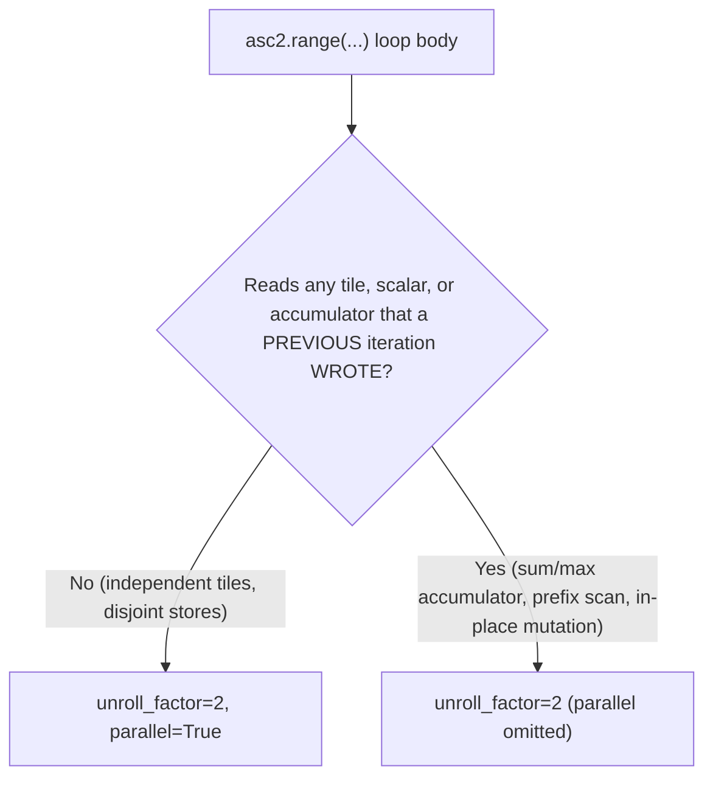

# pyasc asc2 API Best Practices

## API Category Index

| API Category | Key APIs | Typical Scenarios |
|-------------|----------|-------------------|
| **Memory** | `asc2.tensor`, `asc2.load`, `asc2.store` | Global memory access, tile load/store |
| **Computation** | `x + y`, `asc2.abs(x)`, `asc2.exp(x)`, `asc2.where()` | Element-wise and reduction ops |
| **Control flow** | `asc2.range(n)` | Tile loops with optional unrolling |
| **Programming model** | `asc2.block_idx()`, `asc2.block_num()` | Multi-core work distribution |
| **JIT** | `@asc2.jit(always_compile=True)` | Compilation control |
| **Kernel params** | `asc.GlobalAddress`, `asc.ConstExpr[int]` | Kernel function signatures |
| **Tiling math** | `asc.ceildiv(a, b)` | Compute tiles per block |

## Core Types

### Kernel parameter types

| Type | Purpose | Example |
|------|---------|---------|
| `asc.GlobalAddress` | Global memory pointer for kernel args | `def kernel(x_ptr: asc.GlobalAddress, ...)` |
| `asc.ConstExpr[int]` | Compile-time integer constant (included in JIT cache key) | `tile_size: asc.ConstExpr[int]` |
| `int` | Runtime integer | `size: int` |

### asc2 tensor and memory types

| Type / Function | Purpose | Example |
|-----------------|---------|---------|
| `asc2.tensor(ptr, [shape])` | Wrap a global memory pointer as a tensor | `x_gm = asc2.tensor(x_ptr, [size])` |
| `asc2.load(gm, [tile_shape], offsets=[...])` | Load a tile from global memory | `x = asc2.load(x_gm, [tile_size], offsets=[offset])` |
| `asc2.store(tile, gm, offsets=[...])` | Store a tile to global memory | `asc2.store(out, out_gm, offsets=[offset])` |

### Configuration types

| Type | Purpose | Example |
|------|---------|---------|
| `asc.runtime.config.Backend` | Execution backend | `Backend.NPU`, `Backend.Model` |
| `asc.runtime.config.Platform` | Target platform | `Platform.Ascend950PR_9599` |

## Common Patterns

### Kernel function pattern (asc2)

```python
import asc
import asc2

@asc2.jit(always_compile=True)
def my_kernel(x_ptr: asc.GlobalAddress, out_ptr: asc.GlobalAddress,
              size: int, tile_size: asc.ConstExpr[int], tile_per_block: asc.ConstExpr[int]):
    x_gm = asc2.tensor(x_ptr, [size])
    out_gm = asc2.tensor(out_ptr, [size])
    base_offset = asc2.block_idx() * tile_size * tile_per_block
    for i in asc2.range(tile_per_block, unroll_factor=2, parallel=True):
        tile_offset = base_offset + i * tile_size
        x = asc2.load(x_gm, [tile_size], offsets=[tile_offset])
        out = asc2.abs(x)  # your operation here
        asc2.store(out, out_gm, offsets=[tile_offset])
```

### Launch pattern (asc2)

```python
TILE_SIZE = 128
CORE_NUM = 16

num_tiles = asc.ceildiv(size, TILE_SIZE)
my_kernel[CORE_NUM](x, out, size, TILE_SIZE, asc.ceildiv(num_tiles, CORE_NUM))
```

Note: asc2 launch uses `kernel[core_num](...)` — no stream argument needed.

### Tiling with ceildiv

asc2 handles tail/non-divisible tile sizes automatically. The tiling pattern is:

```python
TILE_SIZE = 128   # fixed tile size (elements per tile)
CORE_NUM = 16     # number of compute cores

size = data.size
num_tiles = asc.ceildiv(size, TILE_SIZE)
tile_per_block = asc.ceildiv(num_tiles, CORE_NUM)
```

Inside the kernel:
```python
base_offset = asc2.block_idx() * tile_size * tile_per_block
for i in asc2.range(tile_per_block, unroll_factor=2, parallel=True):
    tile_offset = base_offset + i * tile_size
    x = asc2.load(x_gm, [tile_size], offsets=[tile_offset])
    # ... compute ...
    asc2.store(out, out_gm, offsets=[tile_offset])
```

**Why `ConstExpr`?** `tile_size` and `tile_per_block` are passed as `asc.ConstExpr[int]` so the JIT compiler can optimize tile-level code and include these values in the cache key.

### Tile sizing for vector-only ops (perf-aware)

`TILE_SIZE = 128` is a safe **correctness** default, but it is often a poor
**performance** default for elementwise/reduction kernels: a 128-element tile
leaves the AIV vector pipeline mostly idle behind per-tile MTE setup and loop
overhead. For perf-sensitive vector ops, use a **wide tile** that keeps the
vector units busy and amortises per-tile setup, mirroring the ops-math arch35
elementwise tile policy:

```python
# perf-aware (oracle_guided) — wide tile for AIV utilisation
TILE_SIZE = 2048   # vs 128 correctness default
CORE_NUM  = 16
# size must be a multiple of TILE_SIZE * CORE_NUM (aligned_only)
```

Evidence (camodel `Ascend950PR_9599`, abs/float16, `[32,4096]`, vs the
hand-written AscendC `aclnnAbs`): `TILE_SIZE=128` → ratio ≈ 0.20;
`TILE_SIZE=2048` → ratio ≈ 0.93 (within 7% of hand-written). The op is
unchanged — only the tile width moves the number. See
[`docs/perf-vs-ascendc-demo.md`](../../docs/perf-vs-ascendc-demo.md) and
[`docs/perf-methodology/ticks-calculation.md` §8](../../docs/perf-methodology/ticks-calculation.md).

Reference tile policy (hand-written AscendC, arch35):
[`ops-math/math/abs/op_host/arch35/abs_tiling_arch35.cpp`](/home/aloschilov/workspace/ops-math/math/abs/op_host/arch35/abs_tiling_arch35.cpp)
and [`add_tiling_arch35.cpp`](/home/aloschilov/workspace/ops-math/math/add/op_host/arch35/add_tiling_arch35.cpp).

> Keep the **rank-1 flatten** invariant when widening the tile: declare the GM
> tensor as `asc2.tensor(x_ptr, [size])` and load `[tile_size]` with a 1D
> `offsets=[tile_offset]`. Widening `TILE_SIZE` does not change the rank rules.

> **CRITICAL**: Any value used in the **shape** argument of `asc2.load` or `asc2.tensor`
> MUST be either a literal integer, a `ConstExpr[int]` parameter, or a compile-time
> expression. Using a plain `int` parameter in load shape (e.g., `asc2.load(gm, [cols])` where
> `cols: int`) will cause `RuntimeError: All values in 'shape' must be integers` at JIT time.
> Always declare such parameters as `asc.ConstExpr[int]`.

### Recommended `asc2.range` parameters (PR 190 defaults)

Two kwargs of `asc2.range` (signature in
[docker/pyasc-overlay/asc_language_tile/range.py](../../docker/pyasc-overlay/asc_language_tile/range.py))
materially change codegen quality:

- `unroll_factor: int = 1` — loop unroll attribute placed on the emitted
  `ForOp`. Higher values give the compiler more scheduling freedom.
- `parallel: bool = False` — flags the loop as having no carried
  dependencies, allowing iteration-level reordering / vectorisation.

The compiler-team [PR 190](https://gitcode.com/compiler-team/pyasc/pull/190)
upgrades these from "advanced tuning knob" to "expected default": every
`asc2.range` should set `unroll_factor=2`, and `parallel=True` should be
applied whenever the loop has no read-after-write through a value defined
outside the loop.

**Decision rule:**



**Pattern table** (which form to ship for each loop kind in the proven
golden patterns):

| Loop kind | Example | `unroll_factor` | `parallel` |
|---|---|---|---|
| Elementwise tile loop | `for i in asc2.range(tile_per_block)` | 2 | True |
| Row distribution | `for r in asc2.range(asc2.block_idx(), num_rows, asc2.block_num())` | 2 | True |
| Disjoint slice loop inside a row (e.g. RMSNorm split_d write-back) | `for tile_id in asc2.range(num_tiles)` | 2 | True |
| Reduction accumulator (e.g. RMSNorm split_d `sum_sq = sum_sq + ...`) | `for tile_id in asc2.range(num_tiles)` | 2 | omit (default `False`) |
| Compile-time loop over `asc.ConstExpr[int]` (matmul m / n loops) | `for i in range(m_tiles_per_block)` (Python `range`, not `asc2.range`) | n/a | n/a |

Compile-time loops (last row) are already fully traced/unrolled at JIT
time; wrapping them in `asc2.range(unroll_factor=2)` would emit a runtime
`ForOp` and is a regression. Leave them as plain Python `range`.

**Worked examples:**

```python
# (1) elementwise tile loop -- no carry, fully parallel
for i in asc2.range(tile_per_block, unroll_factor=2, parallel=True):
    tile_offset = base_offset + i * tile_size
    x = asc2.load(x_gm, [tile_size], offsets=[tile_offset])
    asc2.store(asc2.abs(x), out_gm, offsets=[tile_offset])

# (2) row distribution -- each row independent
for r in asc2.range(asc2.block_idx(), num_rows, asc2.block_num(),
                    unroll_factor=2, parallel=True):
    row = asc2.load(x_gm, [1, num_cols], offsets=[r, 0])
    s = asc2.reduce_sum(row)            # accumulation is INSIDE one call
    asc2.store(asc2.full([1, OUT_PAD], s, dtype=asc.float32), out_gm,
               offsets=[r, 0])

# (3) reduction accumulator -- scalar carry across iterations -> NOT parallel
sum_sq = asc2.reduce_sum(asc2.full([1, tile_cols], 0.0, dtype=asc.float32))
for tile_id in asc2.range(num_tiles, unroll_factor=2):     # parallel omitted
    col = tile_id * tile_cols
    x = asc2.load(x_gm, [1, tile_cols], offsets=[row, col]).to(asc.float32)
    sum_sq = sum_sq + asc2.reduce_sum(x * x)
```

### Verification pattern (numpy)

```python
import numpy as np
rng = np.random.default_rng(seed=2026)

# CRITICAL: numpy Generator does NOT support dtype=float16.
# Always generate as float32, then cast:
x = (rng.random(size, dtype=np.float32) * 10 - 5).astype(np.float16)

out = kernel_launch(x)
expected = np.abs(x)
np.testing.assert_allclose(out, expected, atol=1e-3, rtol=1e-3)
```

**Recommended tolerances** (simulator introduces rounding). Each row
cites the upstream source of truth at `pyasc-v2-eval@7b85554a`:

- float16 elementwise: `atol=1e-3, rtol=1e-3` — matches our golden
  `golden/kernels/abs_f16.py`. Upstream `operations/test_unary_ops.py`
  asserts f32 at `atol=1e-3` against `torch.abs`; we extend that
  contract to f16.
- float16 composed (gelu, softmax): `atol=5e-2, rtol=5e-2` — matches
  `golden/kernels/gelu_f16.py`. Upstream `kernels/test_gelu.py` uses
  `rtol=1e-3, atol=1e-5` on f32; we relax for the f16 composed path.
- float32 elementwise (matmul output / accumulators only): `atol=1e-5,
  rtol=1e-5`. **Do not use `1e-5` for elementwise unary on f32** —
  upstream `operations/test_unary_ops.py` ships `asc2.abs(f32)` at
  `atol=1e-3` and our `capabilities.yaml` `abs/float32` cell agrees.
  Use `atol=1e-3, rtol=1e-3` for unary float32 ops.
- float32 composed (gelu, lean exp restatement of tanh/Pade):
  `atol=1e-2, rtol=1e-2`. Upstream `target/test_gelu.py` is tighter
  (`atol=1e-3`) but uses swapped polynomial coefficients (see
  `docs/golden-upstream-map.md`); our looser bound is current
  headroom and may tighten after a stability sweep.

The previous version of this table said `float32 elementwise: 1e-5`
unconditionally, which contradicted `capabilities.yaml` and was a
known driver of agent confusion. The rule of thumb: **trust the
golden's `assert_allclose` value as the contract; if the golden does
not exist yet, take it from upstream `operations/test_*_ops.py` for
that op family**.

## Available asc2 Operations

### Unary operations (on tiles)

| Operation | Usage | Notes |
|-----------|-------|-------|
| `asc2.abs(x)` | Absolute value | |
| `asc2.exp(x)` | Exponential | |
| `asc2.log(x)` | Natural log | |
| `asc2.sqrt(x)` | Square root | |
| `asc2.relu(x)` | ReLU activation | |
| `asc2.erf(x)` | Error function | Noisy on float32 simulator (~1.84-4.7 max abs error); avoid for f32 GELU — use the lean `asc2.exp` restatement instead. |
| `asc2.tanh(x)` | Hyperbolic tangent | Bit-exact on the simulator, but heavier than `asc2.exp`. For f32 GELU, prefer the algebraically-equivalent `x / (1 + asc2.exp(-sqrt(8/pi) * (x + 0.044715*x^3)))` form (see f32 GELU Pattern below) — the asc2.tanh variant pushed the gelu/f32 cell over the 150s sim budget through Phase 9. |
| `asc2.exp(x)` (re-listed for emphasis) | Exponential | Lean primitive; canonical building block for the f32 GELU sigmoid restatement. |
| `asc2.sin(x)` | Sine | |
| `asc2.cos(x)` | Cosine | |
| `-x` | Negate | Unary operator |

### Binary operations (on tiles)

| Operation | Usage | Notes |
|-----------|-------|-------|
| `x + y` | Add | |
| `x - y` | Subtract | |
| `x * y` | Multiply | |
| `x / y` | Divide | |
| `asc2.where(cond, a, b)` | Conditional select | Like `np.where` |

### Reduction operations

| Operation | Usage | Notes |
|-----------|-------|-------|
| `asc2.reduce_sum(x)` | Full sum reduction | Returns scalar tile |
| `asc2.reduce_sum(x, dim)` | Axis sum reduction | Reduce along given dim |
| `asc2.reduce_max(x)` | Max reduction | Returns scalar tile |
| `x.sum()` | Sum reduction | |
| `x.max()` | Max reduction | |
| `x.min()` | Min reduction | |

### Tile creation

| Operation | Usage | Notes |
|-----------|-------|-------|
| `asc2.full(shape, scalar, dtype=...)` | Create tile filled with scalar | **Required** when storing scalar reduction results — last dim must be >= 32/sizeof(dtype) bytes for alignment |

### Advanced operations

| Operation | Usage | Notes |
|-----------|-------|-------|
| `asc2.softmax(x)` | Softmax | Operates on full rows of a 2D tile |
| `asc2.matmul(a, b)` or `a @ b` | Matrix multiply | Requires `asc2.TileLocation` for memory placement |
| `asc2.reduce_sum(x*x)` + `asc2.sqrt(...)` | Root-mean-square layer norm (manual) | Two-kernel + host-dispatcher pattern on **C310 (Ascend950PR_9599)** mirroring CANN's `KernelRmsNormRegBase` (full row in UB) and `KernelRmsNormRegBaseSplitD` (stream along D). Inputs are `torch.Tensor` (numpy is silently zeroed on C310). The `asc2.rms_norm` builtin is currently NOT used. |

## Proven Kernel Patterns

> **Use these exact patterns.** They are extracted from golden kernels verified on the CANN 9.0.0 simulator and cross-referenced against upstream `pyasc-v2-eval@7b85554a:python/test/asc2/`. Deviating from these patterns is the primary cause of runtime failures.

### Rule: rank-consistent tiling

Every `asc2.tensor`, `asc2.load`, `asc2.store`, and `offsets=...` argument
in the same kernel **must use the same rank**. If you declare a 2D
tensor, your load shape is 2D and your offsets are 2D. If you flatten
to 1D, load shape is 1D and offsets are 1D. Never mix.

This is the single most common cause of v2 generative failures —
agents see 2D test shapes in the prompt and emit:

```python
# WRONG -- 2D tensor, 1D load shape, 2D offsets => rank mismatch
x_gm = asc2.tensor(x_ptr, [num_rows, num_cols])
row_idx = tile_offset // num_cols
col_idx = tile_offset % num_cols
x = asc2.load(x_gm, [tile_size], offsets=[row_idx, col_idx])
out = asc2.abs(x)
asc2.store(out, out_gm, offsets=[row_idx, col_idx])
```

v2's strict rank check rejects this immediately:

```
RuntimeError: rank of 'tensor_shape' must match rank of 'shape'
asc.codegen.errors.CodegenError: at <source>:N:M
    x = asc2.load(x_gm, [tile_size], offsets=[row_idx, col_idx])
        ^
```

The fix is either **flatten to 1D** (Pattern A or B below) or **keep
2D and align the load shape to it** (Pattern C). Pick one; do not
half-flatten.

Three patterns are valid on v2 for elementwise / composed-elementwise
kernels. Pick by the kernel's needs; do not invent a fourth.

### Pattern A — 1D flatten (simple)

Source: upstream `pyasc-v2-eval@7b85554a:python/test/asc2/kernels/test_vadd.py`.
Use for any unary or binary element-wise operation (abs, exp, add,
sub, gelu, leaky_relu, etc.) when the test shapes are 1D or can be
collapsed to 1D at the host call site.

```python
TILE_SIZE = 128
CORE_NUM = 16

@asc2.jit(always_compile=True)
def my_kernel(x_ptr: asc.GlobalAddress, out_ptr: asc.GlobalAddress,
              size: int, tile_size: asc.ConstExpr[int],
              tile_per_block: asc.ConstExpr[int]):
    x_gm = asc2.tensor(x_ptr, [size])           # 1D tensor
    out_gm = asc2.tensor(out_ptr, [size])
    base_offset = asc2.block_idx() * tile_size * tile_per_block
    for i in asc2.range(tile_per_block, unroll_factor=2, parallel=True):
        tile_offset = base_offset + i * tile_size
        x = asc2.load(x_gm, [tile_size], offsets=[tile_offset])  # 1D load, 1D offsets
        out = asc2.abs(x)  # replace with your op
        asc2.store(out, out_gm, offsets=[tile_offset])

# Launch (flatten multi-dim test inputs to 1D first):
num_tiles = asc.ceildiv(size, TILE_SIZE)
my_kernel[CORE_NUM](x, out, size, TILE_SIZE, asc.ceildiv(num_tiles, CORE_NUM))
```

If your test shape is multi-dim (e.g. `[24, 512, 1024]`), compute the
flat length at the host: `size = int(np.prod(test_shape))`. The kernel
sees only `size` and never reasons about row/column structure.

### Pattern B — 1D flatten with cache-line aligned tail (production)

Source: upstream `pyasc-v2-eval@7b85554a:python/test/asc2/target/test_vadd.py`.
Use when the kernel must accept non-aligned input sizes (the kernel
declares `tail_behavior: padded` or `aligned_only` with host-side
padding). All Phase 9 new goldens follow this pattern.

```python
ALIGNMENT_ELEMENTS = 32 // input_dtype.itemsize  # 32 bytes / dtype.itemsize
tile_length = asc2.ceildiv(tile_length_request, ALIGNMENT_ELEMENTS) * ALIGNMENT_ELEMENTS
block_loop_num = asc2.ceildiv(asc2.ceildiv(length, core_num), tile_length)
block_length = tile_length * block_loop_num
block_loop_num_tail = asc2.ceildiv(length - block_length * (core_num - 1), tile_length)
padded_length = block_length * (core_num - 1) + tile_length * block_loop_num_tail
# Then pad the host input to padded_length with zeros; the kernel skips
# the last block_loop_num_tail iterations on the final core.

@asc2.jit(static_alloc=True, reuse_ub=True)
def my_kernel(x_ptr: asc2.GlobalAddress, out_ptr: asc2.GlobalAddress,
              input_shape: asc2.ConstExpr, output_shape: asc2.ConstExpr,
              block_loop_num: asc2.ConstExpr, block_loop_num_tail: asc2.ConstExpr,
              tile_length: asc2.ConstExpr, block_length: asc2.ConstExpr,
              UNROLL_FACTOR: asc2.ConstExpr):
    x_gm = asc2.tensor(x_ptr, input_shape)
    out_gm = asc2.tensor(out_ptr, output_shape)
    block_offset = asc2.block_idx() * block_length
    loop_count = block_loop_num
    if asc2.block_idx() == (asc2.block_num() - 1):
        loop_count = block_loop_num_tail
    for i in asc2.range(loop_count, unroll_factor=UNROLL_FACTOR, parallel=True):
        current_offset = block_offset + i * tile_length
        xt = asc2.load(x_gm, [tile_length], offsets=[current_offset])
        zt = asc2.abs(xt)  # replace with your op
        asc2.store(zt, out_gm, offsets=[current_offset])
```

### Pattern C — 2D row-tiled

Source: upstream `pyasc-v2-eval@7b85554a:python/test/asc2/kernels/test_gelu.py`.
Use when the kernel must process one row at a time (per-row reductions
or per-row composed ops where the iteration index is logically a row
index). Ranks are 2D everywhere.

```python
@asc2.jit(always_compile=True)
def my_kernel(x_ptr: asc2.GlobalAddress, out_ptr: asc2.GlobalAddress,
              num_rows: asc2.ConstExpr, num_columns: asc2.ConstExpr,
              tile_size: asc2.ConstExpr):
    x_gm = asc2.tensor(x_ptr, [num_rows, num_columns])    # 2D tensor
    out_gm = asc2.tensor(out_ptr, [num_rows, num_columns])
    for i in asc2.range(asc2.block_idx(), num_rows, asc2.block_num(), parallel=True):
        row = asc2.load(x_gm, [1, tile_size], offsets=[i, 0])  # 2D load, 2D offsets
        # ... per-row computation here, e.g. erf-form GELU:
        k = asc2.sqrt(0.5)
        out = row * (asc2.erf(row * k) + 1) * 0.5
        asc2.store(out, out_gm, offsets=[i, 0])

# Launch:
core_num = 16
tile_size = 1024
my_kernel[core_num](x, out, num_rows, num_columns, tile_size)
```

Note `[1, tile_size]` for the load shape (rank 2) and `[i, 0]` for
offsets (rank 2) — both match the rank of the 2D tensor.

### Composed (gelu, leaky_relu) — choose Pattern A or C

Composed elementwise ops (gelu, leaky_relu) work in either Pattern A
(1D flatten + composed math in the loop body) or Pattern C (2D
row-tiled). Both are valid on v2 as long as **ranks stay consistent**.

Two GELU forms are supported on the simulator; pick by dtype:

```python
# float16 GELU (erf form -- simulator erf precision is fine at f16 tolerance):
k = asc2.sqrt(0.5)
out = x * (asc2.erf(x * k) + 1) * 0.5

# float32 GELU (tanh/Pade form via the LEAN exp/sigmoid restatement
# -- simulator erf is too noisy on f32 AND simulator asc2.tanh
# pushed this cell over the 150s sim budget through Phase 9):
# Math identity: 0.5*x*(1+tanh(sqrt(2/pi)*(x+0.044715*x^3)))
#              = x / (1 + exp(-sqrt(8/pi)*(x+0.044715*x^3)))
# Define module-level constants OUTSIDE @asc2.jit:
#     GELU_C = 0.044715
#     NEG_SQRT_EIGHT_OVER_PI = -math.sqrt(8.0 / math.pi)
x_cub = x * x * x
inner = (x_cub * GELU_C + x) * NEG_SQRT_EIGHT_OVER_PI
out = x / (asc2.exp(inner) + 1)
# Replaces asc2.tanh + scalar_mul + add + scalar_mul with
# asc2.exp + add + div (one fewer asc2 op per tile, no tanh dep).
# Verified in golden/kernels/gelu_f32.py at TILE_SIZE=64, CORE_NUM=16.

# Leaky ReLU kernel op (inside @asc2.jit):
out = asc2.where(x >= 0, x, x * alpha)
```

Simulator constraints to honour:
- **Module-level constants only.** `asc2.*` functions are valid only
  inside a `@asc2.jit` body; module-level constants must use Python or
  `math.*` (e.g. `NEG_SQRT_EIGHT_OVER_PI = -math.sqrt(8.0 / math.pi)`).
  Calling `math.sqrt` inside a `@asc2.jit` body raises
  `RuntimeError: Unsupported function referenced`. Calling `asc2.sqrt(0.5)`
  outside `@asc2.jit` (at module scope) raises
  `AttributeError: 'NoneType' object has no attribute 'create_math_SqrtOp'`.
  Use `asc2.sqrt(0.5)` **inside** the jit body (as in the f16 GELU example)
  or precompute as a module-level Python constant (as in the f32 GELU
  example).
- For f32 GELU, pin `TILE_SIZE = 64`, `CORE_NUM = 16`. With wider tiles
  (128) only the first 64 elements get written (a wide-tile lowering
  bug on C310's simulator path); the rest are silently zero. Same class
  of issue as the wide-tile rms_norm history.

**GELU host-side verification** (pick one):

```python
import math

# float16 erf form: vectorise math.erf -- do NOT use np.erf or scipy.
_verf = np.vectorize(math.erf)
expected_f16 = (0.5 * x * (1.0 + _verf(x.astype(np.float32) / np.sqrt(2.0)))).astype(np.float16)
np.testing.assert_allclose(out_f16.astype(np.float32),
                           expected_f16.astype(np.float32),
                           atol=5e-2, rtol=5e-2)

# float32 tanh form: use np.tanh (no scipy needed):
k = np.sqrt(2.0 / np.pi)
expected_f32 = 0.5 * x * (1.0 + np.tanh(k * (x + 0.044715 * x ** 3)))
np.testing.assert_allclose(out_f32, expected_f32, atol=1e-2, rtol=1e-2)
```

### Tier 1 — Reduction (row-wise)

Use for reduce_sum, reduce_max, etc. Key differences from elementwise:
- 2D tensor layout; rows distributed across cores via `asc2.range(block_idx, num_rows, block_num)`
- Scalar results must be wrapped with `asc2.full()` before storing (32-byte alignment)
- Output buffer must be padded (e.g., `OUT_PAD = 8` for float32)

```python
OUT_PAD = 8  # min last-dim for 32-byte alignment with float32

@asc2.jit(always_compile=True)
def reduce_sum_kernel(x_ptr: asc.GlobalAddress, out_ptr: asc.GlobalAddress,
                      num_rows: int, num_cols: asc.ConstExpr[int],
                      out_pad: asc.ConstExpr[int]):
    x_gm = asc2.tensor(x_ptr, [num_rows, num_cols])
    out_gm = asc2.tensor(out_ptr, [num_rows, out_pad])
    for i in asc2.range(asc2.block_idx(), num_rows, asc2.block_num(),
                        unroll_factor=2, parallel=True):
        row = asc2.load(x_gm, [1, num_cols], offsets=[i, 0])
        s = asc2.reduce_sum(row)            # accumulation is INSIDE one call
        result = asc2.full([1, out_pad], s, dtype=row.dtype)
        asc2.store(result, out_gm, offsets=[i, 0])

# Launch + extract results:
out = np.zeros((num_rows, OUT_PAD), dtype=x.dtype)
reduce_sum_kernel[CORE_NUM](x, out, num_rows, num_cols, OUT_PAD)
result = out[:, 0]  # extract first column
```

### Tier 3 — Advanced (softmax, matmul)

Use `asc2.softmax()` on a block of full rows. Do NOT decompose softmax manually.

**matmul** — supported. Two strict requirements:

1. **Platform must be `Ascend950PR_9599`** (cube unit) — and so does the entire
   stack: it is the only simulator platform CI targets. Pass `-v Ascend950PR_9599`
   when running the kernel script (the goldens default to it).
2. **Inputs must be `torch.Tensor`** (not numpy arrays). The simulator silently
   lowers numpy arrays to zero for matmul. This is the *only* operation that
   requires torch on the host side; everything else stays numpy-only.

The `asc2.matmul` (or `@`) API loads the operands to `L0A` / `L0B` and always
produces a `float32` result tile, even for `float16` inputs.

Proven kernel pattern (from `golden/kernels/matmul_f16.py`):

```python
import torch
import asc, asc2
import asc.runtime.config as config

@asc2.jit(always_compile=True)
def matmul_kernel(a_ptr, b_ptr, c_ptr,
                  a_shape: asc.ConstExpr, b_shape: asc.ConstExpr, c_shape: asc.ConstExpr,
                  m_tile: asc.ConstExpr[int], m_tiles_per_block: asc.ConstExpr[int],
                  n_tile: asc.ConstExpr[int], n_tiles_per_block: asc.ConstExpr[int]):
    a_gm = asc2.tensor(a_ptr, a_shape)
    b_gm = asc2.tensor(b_ptr, b_shape)
    c_gm = asc2.tensor(c_ptr, c_shape)
    block_id = asc2.block_idx()
    m_elems_per_block = m_tile * m_tiles_per_block
    m_base_off = (m_elems_per_block * block_id) % a_shape[0]
    n_base_off = ((m_elems_per_block * block_id) // a_shape[0]) * (n_tile * n_tiles_per_block)
    for j in range(n_tiles_per_block):
        b_offset = n_base_off + j * n_tile
        b_j = asc2.load(b_gm, [b_shape[0], n_tile], offsets=[0, b_offset],
                        location=asc2.TileLocation.L0B)
        for i in range(m_tiles_per_block):
            a_offset = m_base_off + i * m_tile
            a_i = asc2.load(a_gm, [m_tile, a_shape[1]], offsets=[a_offset, 0],
                            location=asc2.TileLocation.L0A)
            c_ij = a_i @ b_j     # asc2.matmul; result is float32
            asc2.store(c_ij, c_gm, offsets=[a_offset, b_offset])

# Host-side launch (torch, not numpy):
a = torch.rand((m, k), dtype=torch.float16)
b = torch.rand((k, n), dtype=torch.float16)
c = torch.zeros((m, n), dtype=torch.float32)   # output is float32
matmul_kernel[core_num](a, b, c, a.shape, b.shape, c.shape,
                        m_tile, m_tiles_per_block, n_tile, n_tiles_per_block)
c_ref = a.to(torch.float32) @ b.to(torch.float32)
torch.testing.assert_close(c, c_ref, atol=1e-2, rtol=1e-2)
```

Tile-size constraints (from the proven pattern):

- `m_tile % 16 == 0`, `n_tile % 16 == 0`
- `m_tile * k * a.element_size() <= 64 KiB` (L0A budget)
- `n_tile * k * b.element_size() <= 64 KiB` (L0B budget)
- `m % m_tile == 0`, `n % n_tile == 0`
- Tiles distributed evenly across `core_num` blocks

Recommended starter shape: `m=k=n=16, core_num=1, m_tile=n_tile=16,
m_tiles_per_block=n_tiles_per_block=1`. Once that passes, scale up.

**softmax** — use `asc2.softmax()` directly:

```python
@asc2.jit(always_compile=True)
def softmax_kernel(x_ptr: asc.GlobalAddress, out_ptr: asc.GlobalAddress,
                   num_rows: int, num_cols: asc.ConstExpr[int],
                   block_size: asc.ConstExpr[int]):
    x_gm = asc2.tensor(x_ptr, [num_rows, num_cols])
    out_gm = asc2.tensor(out_ptr, [num_rows, num_cols])
    start_row = asc2.block_idx() * block_size
    rows = asc2.load(x_gm, [block_size, num_cols], offsets=[start_row, 0])
    out = asc2.softmax(rows)
    asc2.store(out, out_gm, offsets=[start_row, 0])

# Launch:
block_size = asc.ceildiv(num_rows, CORE_NUM)
softmax_kernel[CORE_NUM](x, out, num_rows, num_cols, block_size)
```

**Softmax simulator constraint:** Test ONLY the shape specified in the prompt.
The simulator is extremely slow for large softmax shapes. Do NOT add extra shapes.

#### Normalization layers — two-kernel RMSNorm with host dispatcher (C310)

RMSNorm in this skill stack ships **two `@asc2.jit` kernels** with a
**host-side dispatcher**, mirroring CANN's arch35 (C310) `rms_norm` op
([`opp/built-in/.../rms_norm/rms_norm.cpp`](../../../home/aloschilov/Ascend/cann-9.0.0/opp/built-in/op_impl/ai_core/tbe/impl/ops_nn/ascendc/rms_norm/rms_norm.cpp))
which selects between `KernelRmsNormRegBase` (tiling key `5000`) and
`KernelRmsNormRegBaseSplitD` (tiling key `2001`) based on whether the
row fits in UB. The pyasc analogue is structurally identical:

| CANN kernel | Pyasc analogue | When |
|-------------|---------------|------|
| `KernelRmsNormRegBase` | `rms_norm_full_row_kernel` | Row tile fits in UB; `num_cols` is `asc.ConstExpr[int]` |
| `KernelRmsNormRegBaseSplitD` | `rms_norm_split_d_kernel` | Row exceeds UB; both dims runtime int, host-padded to `tile_cols=64` chunks |

**Platform / I/O contract:**

- Run on `Ascend950PR_9599` (compilation arch `C310`). The skill stack's
  CI routes `rms_norm_*` goldens to that simulator alongside `matmul_*`.
- Inputs are `torch.Tensor` (CPU `float32`/`float16`). Numpy arrays are
  silently zeroed on the C310 simulator path; this is a known property
  of the `Ascend950PR_9599` runtime and applies to RMSNorm as well as
  matmul.

**Host-side dispatcher (verbatim from `golden/kernels/rms_norm_f32.py`):**

```python
UB_BUDGET_BYTES = 64 * 1024  # conservative UB headroom for accumulator + gamma + double-buffer

def rms_norm_launch(x: torch.Tensor, gamma: torch.Tensor,
                    eps: float = 1e-5, core_num: int = 8) -> torch.Tensor:
    num_rows, num_cols = x.shape
    row_bytes = num_cols * x.element_size()
    if row_bytes <= UB_BUDGET_BYTES and num_cols % 8 == 0:
        return _full_row_launch(x, gamma, eps, core_num)
    return _split_d_launch(x, gamma, eps, core_num)
```

The threshold heuristic mirrors CANN's tiling: pick the fast path when
the row fits with headroom; otherwise stream.

**Full-row kernel (`KernelRmsNormRegBase` analogue):**

```python
@asc2.jit(always_compile=True)
def rms_norm_full_row_kernel(x_ptr, gamma_ptr, out_ptr,
                             num_rows: int,
                             num_cols: asc.ConstExpr[int],
                             epsilon: asc.ConstExpr[float]):
    x_gm = asc2.tensor(x_ptr, [num_rows, num_cols])
    gamma_gm_2d = asc2.tensor(gamma_ptr, [1, num_cols])
    out_gm = asc2.tensor(out_ptr, [num_rows, num_cols])
    for row in asc2.range(asc2.block_idx(), num_rows, asc2.block_num(),
                          unroll_factor=2, parallel=True):
        x_row = asc2.load(x_gm, [1, num_cols], offsets=[row, 0])
        x_row_f32 = x_row.to(asc.float32)
        sum_sq = asc2.reduce_sum(x_row_f32 * x_row_f32)
        inv_rms = 1.0 / asc2.sqrt(sum_sq / num_cols + epsilon)
        gamma_row = asc2.load(gamma_gm_2d, [1, num_cols], offsets=[0, 0])
        gamma_row_f32 = gamma_row.to(asc.float32)
        out_f32 = x_row_f32 * gamma_row_f32 * inv_rms
        asc2.store(out_f32.to(x_row.dtype), out_gm, offsets=[row, 0])
```

`num_cols` is `ConstExpr` because the row tile shape `[1, num_cols]` must
be compile-time known. The accumulator stays in float32 even for float16
input via `.to(asc.float32)`.

**Split-D kernel (`KernelRmsNormRegBaseSplitD` analogue):**

Both `num_rows` and `num_cols` are runtime `int`. The row is streamed in
`tile_cols=64` (one Ascend SIMD lane: 64 floats = 256 bytes) tiles, with
host-side zero padding so the tail vanishes:

```python
@asc2.jit(always_compile=True)
def rms_norm_split_d_kernel(x_ptr, gamma_ptr, out_ptr,
                            num_rows: int, num_cols: int, padded_cols: int,
                            num_tiles: int,
                            tile_cols: asc.ConstExpr[int],
                            epsilon: asc.ConstExpr[float]):
    x_gm = asc2.tensor(x_ptr, [num_rows, padded_cols])
    gamma_gm_2d = asc2.tensor(gamma_ptr, [1, padded_cols])
    out_gm = asc2.tensor(out_ptr, [num_rows, padded_cols])
    for row in asc2.range(asc2.block_idx(), num_rows, asc2.block_num(),
                          unroll_factor=2, parallel=True):
        zero_seed = asc2.full([1, tile_cols], 0.0, dtype=asc.float32)
        sum_sq = asc2.reduce_sum(zero_seed)
        # Inner reduction loop carries `sum_sq` -> NOT parallel.
        for tile_id in asc2.range(num_tiles, unroll_factor=2):
            col = tile_id * tile_cols
            x = asc2.load(x_gm, [1, tile_cols], offsets=[row, col])
            x_f32 = x.to(asc.float32)
            sum_sq = sum_sq + asc2.reduce_sum(x_f32 * x_f32)
        inv_rms = 1.0 / asc2.sqrt(sum_sq / num_cols + epsilon)
        # Disjoint write-back -> safe to parallelise.
        for tile_id in asc2.range(num_tiles, unroll_factor=2, parallel=True):
            col = tile_id * tile_cols
            x = asc2.load(x_gm, [1, tile_cols], offsets=[row, col])
            gamma = asc2.load(gamma_gm_2d, [1, tile_cols], offsets=[0, col])
            x_f32 = x.to(asc.float32)
            gamma_f32 = gamma.to(asc.float32)
            out_f32 = x_f32 * gamma_f32 * inv_rms
            asc2.store(out_f32.to(x.dtype), out_gm, offsets=[row, col])
```

Padded zeros don't contribute to `sum_sq`; the kernel divides by REAL
`num_cols` so the result is identical to a no-padding implementation.

**`sum_sq` PlainValue seed (REQUIRED in split_d):** the codegen rejects
`sum_sq = 0.0` because the loop-carried value becomes a `PlainValue`,
giving `'sum_sq' was re-assigned to an object with different type`
([function_visitor.py L241-244](../../pyasc-fork/python/asc/codegen/function_visitor.py)).
Seed with a 1-vector-lane reduce-of-zero (full_row doesn't need this
because there's no carry across tiles):

```python
zero_seed = asc2.full([1, tile_cols], 0.0, dtype=asc.float32)
sum_sq = asc2.reduce_sum(zero_seed)
```

**Host-side launch (split_d):**

```python
padded_cols = ((num_cols + tile_cols - 1) // tile_cols) * tile_cols
x_padded = torch.zeros((num_rows, padded_cols), dtype=x.dtype)
x_padded[:, :num_cols] = x
gamma_padded = torch.zeros((padded_cols,), dtype=gamma.dtype)
gamma_padded[:num_cols] = gamma
out_padded = torch.zeros((num_rows, padded_cols), dtype=x.dtype)
num_tiles = padded_cols // tile_cols
rms_norm_split_d_kernel[CORE_NUM](x_padded, gamma_padded, out_padded,
                                  num_rows, num_cols, padded_cols,
                                  num_tiles, tile_cols, epsilon)
return out_padded[:, :num_cols].clone()
```

**Host-side reference (torch):**

```python
def torch_rms_norm(x, gamma, eps):
    x32 = x.to(torch.float32)
    mean_sq = torch.mean(x32 * x32, dim=-1, keepdim=True)
    return (x32 * torch.rsqrt(mean_sq + eps) * gamma.to(torch.float32)).to(x.dtype)
```

**Tolerances:** float32 `atol=rtol=1e-4` (both branches); float16
`atol=rtol=2e-2` for full_row, `atol=rtol=5e-2` for split_d.

**Test shapes:** `(8, 256)` exercises full_row; `(8, 1055)` exercises
split_d (host pads to `1088 = 17 * 64`). Both verified in a single
`run_kernel` call. The pattern rescales to e.g. `(64, 100003)` by
changing only `CORE_NUM` and the test-shape constants.

**Note on "first or last dim":** RMSNorm here normalizes along the last
dim only. Prompts that mention "first or last dimension" should be
answered with the last-dim form above; the runtime contract above is
what makes the row dim dynamic.

## Common Mistakes

> These mistakes cause runtime failures even when static verification passes.

| Mistake | Why it fails | Fix |
|---------|-------------|-----|
| **Rank-inconsistent tiling**: 2D `asc2.tensor(..., [num_rows, num_cols])` + 1D `asc2.load(..., [tile_size], ...)` + 2D `offsets=[row_idx, col_idx]` | v2 rejects with `RuntimeError: rank of 'tensor_shape' must match rank of 'shape'` before any numerics run. The wip-era simulator was lenient; v2 enforces. Single biggest cause of v2 generative drift across abs/{f16,f32}, gelu/f16, add/f16 in Stage 3.3 evidence | Pick **one** rank and stay there. Either flatten to 1D (Pattern A) and use `asc2.tensor(..., [size])` + `[tile_size]` load + `[tile_offset]` offsets, **or** keep 2D (Pattern C) and use `[1, tile_size]` load + `[i, 0]` offsets. Never mix |
| `break`, `continue`, or early `return` inside `@asc2.jit` | Not supported by the AST codegen | Remove; restructure loop logic |
| `if row_idx >= num_rows: pass` bounds guard | asc2 handles bounds automatically; `if` with `pass` confuses codegen | Remove the guard entirely |
| Tiling softmax with sub-row chunks | `asc2.softmax` needs the full row to compute the denominator | Load full `[block_size, num_cols]` and call `asc2.softmax` once |
| Making the norm dim of `asc2.softmax` dynamic | `asc2.softmax`'s shape entries must be compile-time known | Keep the softmax norm (last) dim `asc.ConstExpr[int]`; only the batch/row dim can be runtime `int`. RMSNorm has its own dynamic-`num_cols` path (split_d kernel + host padding) |
| Passing numpy arrays to a C310 (`Ascend950PR_9599`) kernel | The C310 simulator path silently zeroes numpy inputs; observed first for matmul, also affects `rms_norm_*` goldens | Use `torch.Tensor` everywhere on C310 (CPU `float32`/`float16`); compare with `torch.testing.assert_close` |
| Initializing a loop-carried scalar accumulator with a Python literal: `sum_sq = 0.0; sum_sq = sum_sq + plain_value` | Codegen does a strict `type(old) is not type(new)` check, so `float` vs `PlainValue` raises `'sum_sq' was re-assigned to an object with different type` | Seed with a 1-vector-lane reduce-of-zero: `sum_sq = asc2.reduce_sum(asc2.full([1, tile_cols], 0.0, dtype=asc.float32))`. Only required for split_d; full_row reduces inside one tile and has no carry across tiles |
| Hand-rolling streaming RMSNorm with `asc2.mask` / wide `asc2.full([1, tile_cols], inv_rms)` for `tile_cols > 64` | In MR-85, `asc2.mask` does not constrain stores, and wide `asc2.full` / scalar broadcast only fill one 64-lane vector | Use `tile_cols=64` (one SIMD lane) plus host-side zero padding; see `golden/kernels/rms_norm_f32.py` (split_d kernel) |
| Pure scalar `asc2.store(plain_value, gm, offsets=[r, c])` from a multi-core kernel (the doc's column-loop pattern) | MR-85 multi-core `SetValueOp` is dropped on even-indexed blocks: rows from `block_idx ∈ {0, 2, 4, ...}` come back as zero | Use tile stores (`asc2.store(tile, gm, offsets=...)`) of `[1, 64]` tiles or larger instead — same row-distribution scheme, no `SetValueOp` |
| Storing scalar reduction result directly | Tile last-dim must be >= 32 bytes; scalar is too small | Wrap with `asc2.full([1, pad], scalar, dtype=...)` |
| Using `scipy` for verification | Not installed in the simulator Docker image | Use only `numpy` and `math` stdlib (or `torch` for matmul I/O only) |
| Using numpy arrays for `asc2.matmul` inputs | The simulator silently lowers numpy arrays to zero for matmul | Use `torch.Tensor` (CPU) for matmul host-side data; verify with `torch.testing.assert_close` |
| Accidentally running with `-v Ascend910B1` | The stack only targets `Ascend950PR_9599`; matmul also requires the C310 cube unit | Pass `-v Ascend950PR_9599` (or omit `-v` — kernels default to it) |
| `num_cols: int` in kernel when used in `asc2.load` shape | Shape args must be compile-time known | Declare as `num_cols: asc.ConstExpr[int]` |
| Skipping `asc.ceildiv` for tiling | Manual division causes wrong tile counts | Always use `asc.ceildiv(a, b)` |
| Using `range()` instead of `asc2.range()` inside kernel | Python `range` is not JIT-compatible | Replace with `asc2.range()` |
| `rng.random(shape, dtype=np.float16)` for test data | numpy Generator does not support float16 | Generate as float32, then cast: `rng.random(shape, dtype=np.float32).astype(np.float16)` |
| `np.erf(x)` or `scipy.special.erf(x)` for host-side reference | numpy has no `erf`; scipy not in Docker | Use `import math; _verf = np.vectorize(math.erf); result = _verf(x)` |
| Tolerance too tight for simulator (`atol=1e-5` for unary float32) | Simulator introduces rounding; even unary f32 ops accumulate error. Upstream `operations/test_unary_ops.py` ships f32 at `atol=1e-3` | Use `atol=1e-3, rtol=1e-3` for float16 elementwise; `atol=1e-3, rtol=1e-3` for float32 unary elementwise (matches `capabilities.yaml` + upstream `operations/test_unary_ops.py`). Reserve `1e-5` for matmul output / accumulators only |
| Testing many/large shapes on simulator | Simulator is ~1000x slower than NPU; large shapes cause timeouts | Test 1-2 shapes per run; keep total elements ≤ 131072 for float16 |
| `asc2.range(...)` without `unroll_factor=2` | Defaults to `unroll_factor=1`; leaves PR 190 perf on the table | Always pass `unroll_factor=2` (and `parallel=True` when the loop body has no carried dependency — see "Recommended asc2.range parameters" above) |
| `parallel=True` on a loop with a carried scalar accumulator (`sum_sq = sum_sq + ...`, running max, prefix scan) | Iteration order is no longer guaranteed; accumulator updates collide and the reduction is silently wrong | Omit `parallel` (default `False`) on accumulator loops. Only the *outer* row distribution and *disjoint-tile* inner loops can be `parallel=True` |
| `scalar * tile` ordering inside `@asc2.jit` (e.g. `0.044715 * x_cubed`, `GELU_K * inner`) | The asc2 `Tile` class does not implement `__rmul__`; Python's fallback raises `AttributeError: 'Tile' object has no attribute '__rmul__'` at codegen time | **Always put the Tile on the LEFT** of `*`: write `x_cubed * 0.044715`, `inner * GELU_K`, `x * 0.5`. The same rule applies to `+`/`-`/`/` if you ever hit the symmetric case. See `golden/kernels/gelu_f32.py` (lines 54–55) for the canonical layout |

### Editing `capabilities.yaml`

The nightly bot owns `generative_status` and the `evidence/*-generative.json`
files. It runs `tests/tools/sync_capabilities.py` after each nightly,
demoting any cell whose latest run failed and promoting any cell whose
latest run passed. **Always `git pull` before hand-editing
`capabilities.yaml`** — otherwise a stale local edit can silently re-promote
a cell the bot just demoted (this happened with `gelu/float32` on
`28f8c77` → `8160e96`).

The PR gate runs `check_capabilities.py --soft-runtime`: a confirmed cell
with a fail in evidence shows up as `[DRIFT]` warning, not a hard fail,
so an unrelated commit cannot be blocked by a flaky generative cell that
the next nightly will reconcile. Merge-gate and nightly-gate still run
the strict variant (i.e. `check_capabilities.py` without `--soft-runtime`).
If you see `[DRIFT]` locally, run `python3 tests/tools/sync_capabilities.py`
and commit the resulting capabilities.yaml.

## API Restrictions

### Required host imports & forbidden APIs

**Every kernel module MUST begin with these three imports** (typically at module
top, before the `@asc2.jit` body):

```python
import asc
import asc.runtime.config as config
import asc2
```

`asc` provides the host-side types (`asc.GlobalAddress`, `asc.ConstExpr[T]`,
`asc.ceildiv`) used in the kernel signature. `asc2` provides every kernel-side
op (`asc2.tensor`, `asc2.load`, `asc2.store`, `asc2.range`, `asc2.exp`,
`asc2.tanh`, `asc2.erf`, `asc2.where`, `asc2.softmax`, `asc2.matmul`,
`asc2.block_idx`, `asc2.block_num`, ...). Missing `import asc2` while still
calling `asc2.foo(...)` raises `NameError: name 'asc2' is not defined` at
simulator launch and burns the full 150 s sim budget before failing — this
was the failure mode for `rms_norm/f16 P3/r2` in Phase 9 evidence.

**Forbidden legacy frameworks.** All kernels in this skill stack target the
asc2 v2 surface only. Do **not** import or call any of the following:

| Banned symbol | Why |
|---|---|
| `import ascendcl`, `from ascendcl import ...` | Pre-v2 device-runtime; not on the v2 sim path. `ModuleNotFoundError` at runtime (observed: `gelu/f16 P4/r2`, Phase 9). |
| `import tik`, `import tik2` | TBE / TIK is the v1 codegen surface. Submitting a TIK kernel produces output that the v2 sim either ignores or refuses to verify — the trial is recorded as `verification unclear` (observed: `abs/f16 P3/r3`, Phase 9). |
| `from tbe.*`, `import tbe.dsl.*` | TBE DSL; same reason as `tik`. |
| `TPosition`, `Tensor.npu()`, `.npu()`, `LocalTensor` | Manual position/dispatch markers from the v1 stack. `@asc2.jit(insert_sync=True)` handles placement automatically. |
| `scipy`, `scipy.special.*` | Not installed in the Docker image; use `math.*`, `numpy.*`, or `np.vectorize(math.fn)` instead. |

These are scored at static-verify time (`tests/tools/score_kernel.py` emits
`F_legacy_api_import` for any of the banned symbols above, and
`F_missing_asc2_import` if any `asc2.*` call is reached without an
`import asc2`). A `static_verify: fail` short-circuits the trial *before*
the 150 s simulator window, so the agent gets an immediate signal.

**Per-cell opt-out.** A cell that genuinely needs a legacy API (none today)
can set `allow_legacy_apis: true` in its `capabilities.yaml` block; the
scorer will skip the ban.

### Do not use inside `@asc2.jit` functions

- `print()` — use `assert` with f-strings for debug messages
- Standard library imports — all imports must be outside JIT scope
- Dynamic Python features (exceptions, generators, etc.)

**Type constraints for kernel parameters**:
- Supported: `bool`, `int`, `float`, numpy scalars/ndarray, `asc.GlobalAddress`
- Not supported as runtime args: `str`, `tuple`, `list`, `dict` (use `asc.ConstExpr[T]` for compile-time)
- Use `asc.ConstExpr[int]` for any parameter that appears in `asc2.load` shape or `asc2.tensor` shape

**Host-side data preparation**:
- Default: use **numpy** arrays for data inputs and verification.
- **Exception (matmul only)**: the cube unit needs `torch.Tensor` inputs on the
  simulator. Use `torch.float16` inputs and a `torch.float32` output buffer,
  and verify with `torch.testing.assert_close`. `torch` (CPU) is installed in
  the Docker image specifically for matmul.
- Do NOT import `scipy` — it is not used by any kernel and bloats the prompt.

**What asc2 handles automatically** (do NOT do manually):
- Pipeline synchronization (`set_flag`/`wait_flag`) — `@asc2.jit` sets `insert_sync=True`
- DMA transfers — use `asc2.load`/`asc2.store` instead of `asc.data_copy`
- Buffer management — no `BUFFER_NUM`, `LocalTensor`, or `TPosition` needed
- Double buffering — handled by `run_asc2_passes=True`

## References

- [JIT Options](references/api-jit-options.md)
